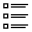

Admin Panel
===========

In this article:
    - `Introduction`_
    - `Panel Features`_

------------
Introduction
------------

ImCMS 6 provide new modern Admin Panel with several features.

--------------
Panel Features
--------------

.. |editModeIcon| image:: admin-panel/_static/02-EditMode.png
    :width: 20pt
    :height: 20pt

- |readOnlyModeIcon| ReadOnly Mode - Enable read only mode and hide any on-place editors.

- |editModeIcon| Edit Mode - enable edit mode - all available in template editor will show on page.

- |pageInfoIcon| PageInfo - show current document information and give ability for edit it.

- |documentsIcon| Document Editor - list all presented documents in the system.

- |adminManagerIcon| Admin Manager - open backend admin manager.

- |logoutIcon| Logout - logout current user from ImCMS system.
