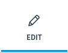

Admin Panel
===========

In this article:
    - `Introduction`_
    - `Panel Features`_

------------
Introduction
------------

ImCMS 6 provide new modern Admin Panel with several features.

--------------
Panel Features
--------------

:width: 60pt
    :height: 60pt

:width: 60pt
    :height: 60pt

:width: 60pt
     :height: 60pt

:width: 60pt
     :height: 60pt

:width: 60pt
    :height: 60pt

:width: 60pt
    :height: 60pt

:width: 60pt
    :height: 60pt

:width: 60pt
    :height: 60pt

:width: 60pt
    :height: 60pt

    - |publicModeIcon| Public Mode - enable public mode - Show all published contents.

    - |editModeIcon| Edit Mode - enable edit mode - all available in template editor will show on page.

    - |previewIcon| Preview Mode - enable preview mode - prepare to show published contents on the page.

    - |publishIcon| Publish Mode - publishing - publish current page.

    - |pageInfoIcon| PageInfo - show current document information and give ability for edit it.

    - |documentsIcon| Document Editor - list all presented documents in the system.

    - |adminManagerIcon| Admin Manager - open backend admin manager.

    - |logoutIcon| Logout - logout current user from ImCMS system.

    - |settingPanelIcon| Setting panel - show all setting for panel admin.

