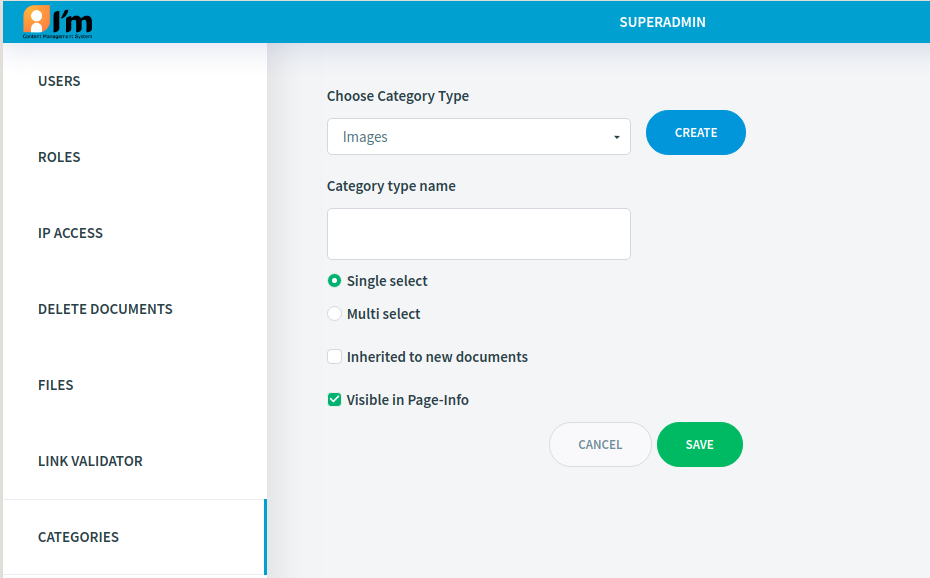
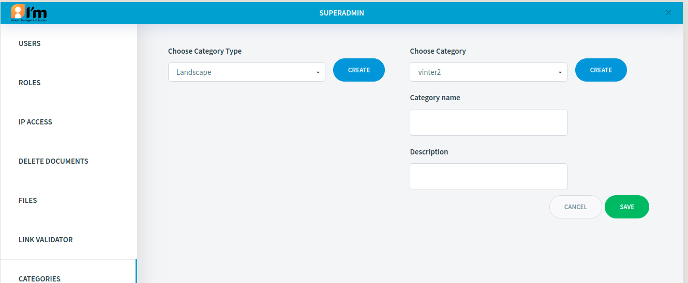

Category Management
===================

In this article:
    - `Introduction`_
    - `Create Category Type and Category`_

------------
Introduction
------------

To classify elements in the system ImCMS provide well known things that called categories. The main concept is that the base type
of categories is **Category Type**. It can include several categories and applied for all elements in the system that support classifying
(such as document, images, etc). Each category type can be simple or complex. Simple category type provide only one category selecting, complex provide multiply category selecting.

---------------------------------
Create Category Type and Category
---------------------------------

Category editor located on ``/servlet/AdminCategories``

.. image:: category/_static/01-CategoryEditorAdminPage.png

To create new category first create new category type.

``Name`` - future category type name;

``Single select`` - only one category can be selected from this category type;

``Multi select`` - provide multiple category selecting;

``Inherited to new documents`` - enable inheritance for new documents, that is mean that all new documents, create from prototype document,
inherited already chosen category for this category type;

``Visible in Page-Info`` - visible this category type and categories to page info tab

Now, create category as show on image below

``Category name`` - name of created category;

``Description`` - short description of created category;
