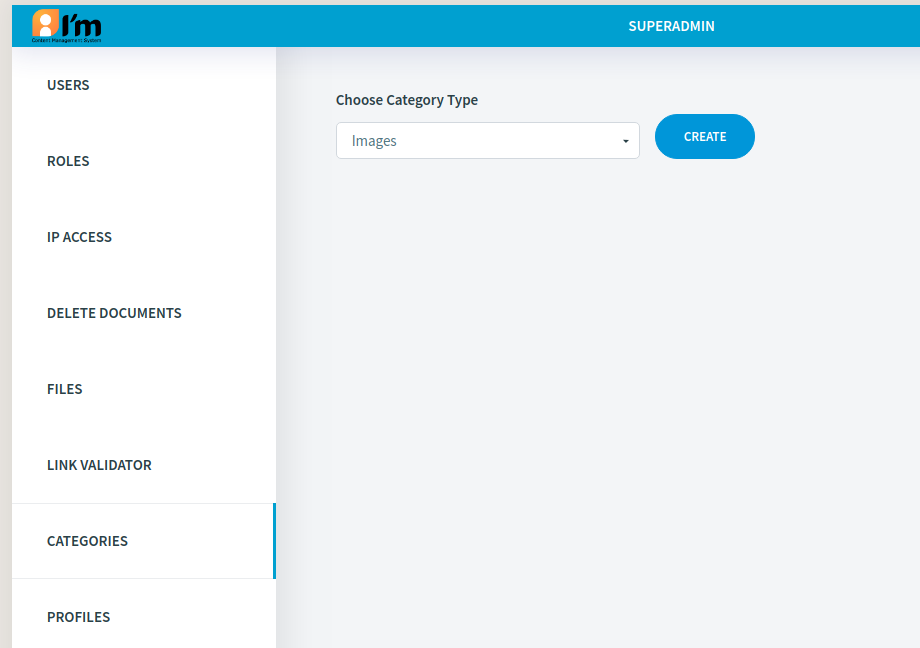

Category Management
===================

In this article:
    - `Introduction`_
    - `Edit File`_

------------
Introduction
------------

To classify elements in the system ImCMS provide well known things that called categories. The main concept is that the base type
of categories is **Category Type**. It can include several categories and applied for all elements in the system that support classifying
(such as document, images, etc). Each category type can be simple or complex. Simple category type provide only one category selecting, complex provide multiply category selecting.

--------------------
Create Category Type
--------------------

Category editor located on ``/servlet/AdminCategories``

