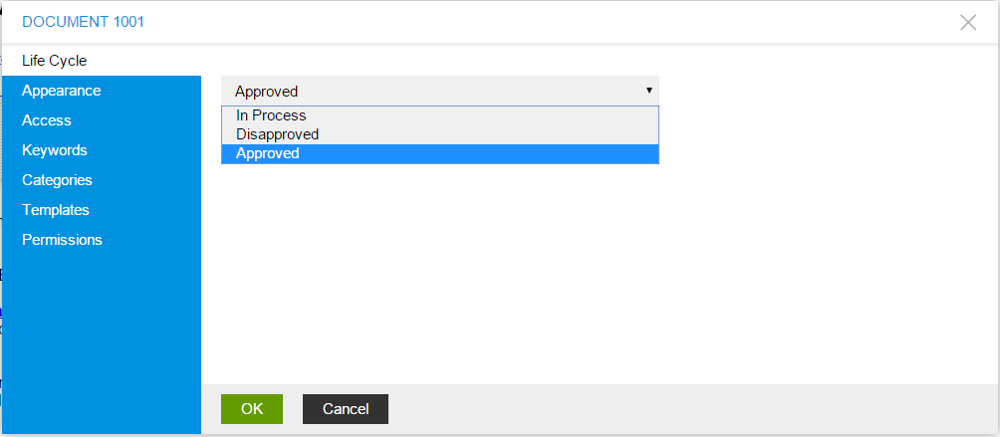

Base Management
===============

In this article:
    - `Introduction`_
    - `Edit Life Cycle`_
    - `Edit Appearance`_
    - `Edit Access`_
    - `Edit Keywords`_
    - `Edit Categories`_
    - `Edit Permissions`_

Introduction
------------

This article describes basic document configuration, base section of it, how document should be configured.

Edit Life Cycle
---------------

ImCMS provide base document managing, that help change document status. There are 3 types of life cycle exists:

- In Process - it is mean that document has just been crated and it is preparing now.
- Approved - this status says that document is ready to use.
- Disapproved - document is disabled, and cannot be accessed.

Edit Appearance
---------------

This editor section provides access to manage documents alias, how document will be opened from menu(in new window, in same frame, etc)
document name, description, link image for all available in ImCMS system languages.

.. image:: base/_static/01-EditAppearance.png

