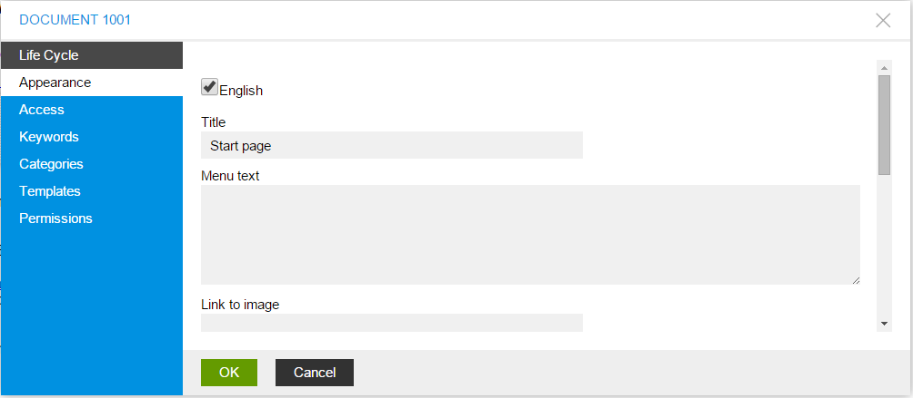
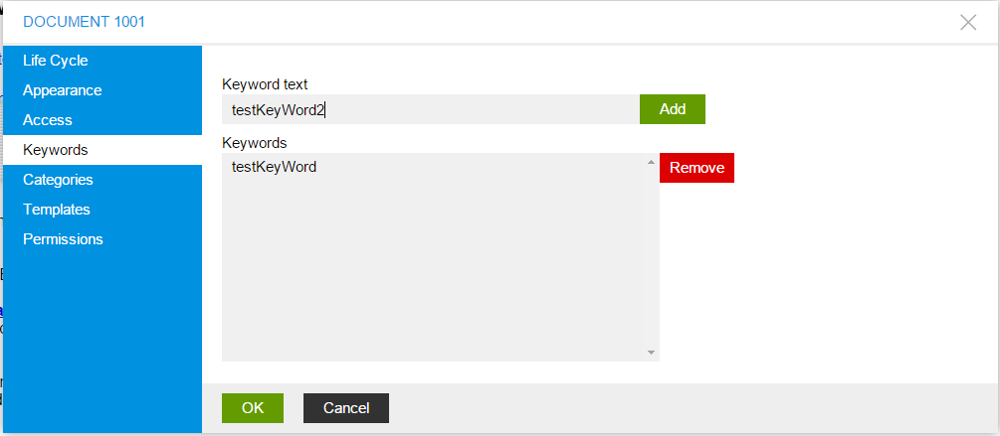

Base Management
===============

In this article:
    - `Introduction`_
    - `Create Document`_
    - `Edit Life Cycle`_
    - `Edit Appearance`_
    - `Edit Access`_
    - `Edit Keywords`_
    - `Edit Categories`_

------------
Introduction
------------

This article describes basic document creating and configuring.

---------------
Create Document
---------------

Today there are two way of document creation:
    - Create document in document manager:
        1. Click on *Documents* on *Admin Panel*

        .. image:: base/_static/05-OpenDocumentManager.png

        2. In opened window click on *Create new...* button to open *new document dialog*

        .. image:: base/_static/06-CreateNewDocument.png

        3. Opened window is *document prototyping* window: **Document Type** - document type such as Text Document,
        or File Document, etc; **Document Parent** - document parent document, that will be inherited for current document.

        .. image:: base/_static/07-PrototypeNewDocument.png

---------------
Edit Life Cycle
---------------

ImCMS provide base document managing, that help change document status. There are 3 types of life cycle exists:

- In Process - it is mean that document has just been crated and it is preparing now.
- Approved - this status says that document is ready to use.
- Disapproved - document is disabled, and cannot be accessed.

.. image:: base/_static/02-EditLifeCycle.png

---------------
Edit Appearance
---------------

This editor section provides access to manage documents alias, how document will be opened from menu(in new window, in same frame, etc)
document name, description, link image for all available in ImCMS system languages.

-----------
Edit Access
-----------

Since ImCMS is care about document securing it provide editor section for configure user-role linking with permission set
for current document.
There are five types of roles:
- NONE - no access to current page
- VIEW - role with this permission can only view content on this page
- RESTRICTED 1 - first custom permission set
- RESTRICTED 2 - second custom permission set
- FULL - role with this permission have access to any configuration of current document (usual it is **admin**)

More information about custom permission sets configuration is in :doc:`Text Document Management </content-management/document/text-document>` section

.. image:: base/_static/02-EditAccess.png

-------------
Edit Keywords
-------------

Each document in ImCMS system is indexed by the search system, that called :doc:`Solr </fundamental/advanced-configuration/solr>`.
That`s why it is very important to mark document with special keywords that make searching easily.

---------------
Edit Categories
---------------

Since ImCMS provide categories, each document can categorized. It should be noted, that one document can be assigned to
several categories at the same time if category type support multiply selecting.

.. image:: base/_static/04-EditCategories.png