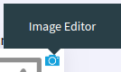

Image Management
================

In this article:
    - `Introduction`_
    - `Open Editor`_
    - `Using Editor`_

------------
Introduction
------------

ImCMS 6 provide feature - on-place image-editor, that can help easily change image on page.

-----------
Open Editor
-----------

- First enable **Edit Mode**.

- To open image editor Find on the left side of the page blue label with text **Image Editor** (as shown below)
and click on it to open the editor. When label hovered - the linked image is highlighted.

------------
------------
Using Editor
------------

There are several base part are in the image editor:

    - ``Image Viewer`` - it include scaled or full size image with image crapper over it.

    .. image:: image/_static/02-ImageViewerPart.png

    - ``Image Cropper`` - part of Image Viewer, the main function of it it is crop image. All features of it shown on image bellow.

    .. image:: image/_static/03-ImageCropperPart.png

    - ``Image Info`` - numeric configuration part of editor, it provide information about image size, size of cropped area,
    etc.

    .. image:: image/_static/04-ImageInfoPart.png

    - ``Image Chooser`` - it is a part of the Image Info and presented as button that open File-Content Manager.
