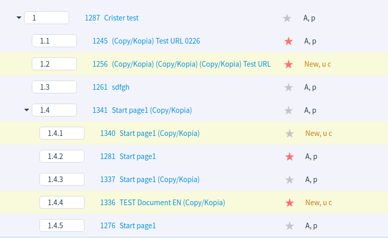
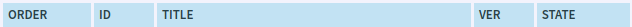

Menu Management
===============

In this article:
    - `Introduction`_
    - `Add Menu Item`_
    - `Order Menu Items`_

------------
Introduction
------------

This section describes how manage menu - add menu item, sorting and ordering existing menu items, etc.

-------------
Add Menu Item
-------------

ImCMS Menu Editor provide several way for adding document to menu:

#.
    From search box that located in the left-bottom corner of menu-editor. When required document had been found click on the green button with text *Add*.

    .. image:: menu/_static/01-AddMenuItemFromSearchBox.png

#.
    From search dialog. To open search dialog click on marked button (figure below).

    .. image:: menu/_static/02-OpenSearchDialogButton.png

    In opened window type document name, and from presented result select required document and then click *Add selected* button.

    .. image:: menu/_static/03-SearchDialog.png

#. From new document. To create new document from menu editor consider :doc:`Base Document Management </content-management/document/base>` section.

.. _label:
    * nothing

----------------
Order Menu Items
----------------

ImCMS menu has tree-structure. Each item can include several sub-item and can be included to another parent item.

ImCMS provide easy way to order menu-item by drag-n-dropping. To order items click on required one and drug and drop it
into/above/below another one.

