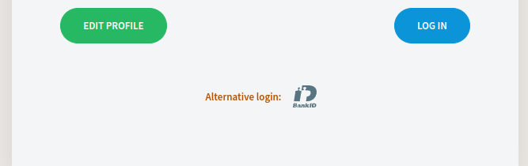

Authentication
==============

In this article:
    - `Introduction`_
    - `2FA`_
    - `BankID`_
    - `External Authenticator`_

------------
Introduction
------------

.. image:: _static/authentication/login-page.png

Here is provided simple login page. You can enable additional authenticators using properties.

---
2FA
---

Two Factory Authentication through sms code and One Time Password(OTP)
""""""""""""""""""""""""""""""""""""""""""""""""""""""""""""""""""""""

In order to enable it, you have to:

1. Set appropriate property to true.

.. code-block:: properties

    # enable/disable two factory authentication
    2fa.enabled = false

2. You need properly configured SmsService. Look at properties.

By default there are preconfigured properties but you can also do it by yourself:

- Cookie lifetime
- OTP length
- OTP letters and numbers

In user edit 2fa can be enabled/disabled for each users.

------
BankID
------

BankID – is an external swedish authenticator
"""""""""""""""""""""""""""""""""""""""""""""

To enable it you have to set appropriate property to true.

.. code-block:: properties

    # bank id
    cgi.enabled = true

By default there are preconfigured properties but you can also do it by yourself.

- Metadata URL provider(``cgi.metadata-url``)
- BankID user role name (``cgi.user-role-name``)

----------------------
External Authenticator
----------------------

.. warning:: You can have only one external authenticator!

****************************
AAD – Azure Active Directory
****************************

To enable you have to set appropriate properties to “aad”.

.. code-block:: properties

    ExternalAuthenticator=aad
    ExternalUserAndRoleMapper=aad

********************************************
LDAP - Lightweight Directory Access Protocol
********************************************

To enable you have to set appropriate properties to “ldap”.

.. code-block:: properties

    ExternalAuthenticator=ldap
    ExternalUserAndRoleMapper=ldap
