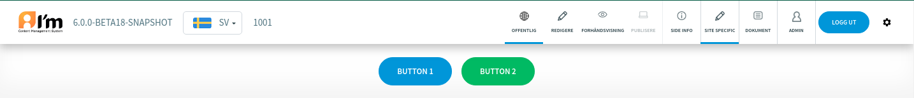
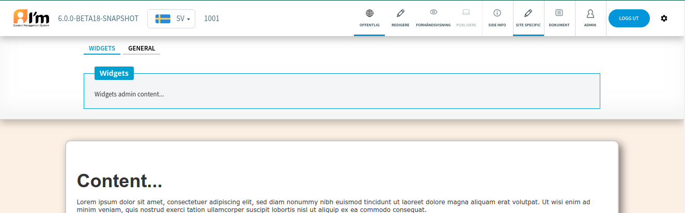

Custom Admin Tab
================

In this article:
    - `Introduction`_
    - `How to add additional Admin Tab`_
    - `Usage Example`_

------------
Introduction
------------

ImCMS provide the ability to add an additional tab in the :doc:`Admin Panel </user-documentation/admin-panel>`.
You can implement the needed functionality here.

-------------------------------
How to add additional Admin Tab
-------------------------------

In order to add additional tab, you have to:

1. Add markup inside such a div on the page:

    .. code-block:: html

        

            ...
        

    ``data-link-text`` - tab name.
    ``data-title-text`` - tab title.

2. Initialize tab and functionality. Be sure to use the following function to initialize the tab. You can also pass a function with initialization of your own logic.

    .. code-block:: js

        Imcms.initSiteSpecific(addEventsToSpecialAdmin);

3. Allow access only for admins. Be sure to place your markup and scripts inside the ``<imcms:ifAdmin>`` tag (more :doc:`here </developer-documentation/design/tags/admin>`).

-------------
Usage Example
-------------

.. code-block:: jsp

    <%@ page contentType="text/html;charset=UTF-8" pageEncoding="UTF-8" %>
    <%@ taglib prefix="imcms" uri="imcms" %>
    <!DOCTYPE html>
    <html lang="en">
    <head>
        <meta charset="UTF-8">
        <meta name="viewport" content="width=device-width, initial-scale=1.0">
        <title>Imcms Demo Page</title>

        

    <%-- This tag adds scripts and styles that are used by the system if the user is the *admin*. Must be in the head. --%>
        <imcms:admin/>
    </head>
    <body>

    <imcms:ifAdmin>
        

            

                <ul id="imcmsAdminTabs">
                    <li data-for="widgets" class="tab-active">Widgets</li>
                    <li data-for="general">General</li>
                </ul>
                

                    <fieldset>
                        <legend>Widgets</legend>
                        Widgets admin content...
                    </fieldset>
                

                

                    <fieldset>
                        <legend>General</legend>
                        General admin content...
                    </fieldset>
                

            

        

        
    </imcms:ifAdmin>

    

        <h1>Сontent...</h1>
        
Lorem ipsum dolor sit amet, consectetuer adipiscing elit, sed diam nonummy nibh euismod tincidunt ut laoreet
            dolore magna aliquam erat volutpat. Ut wisi enim ad minim veniam, quis nostrud exerci tation ullamcorper
            suscipit lobortis nisl ut aliquip ex ea commodo consequat.

    

    </body>
    </html>

