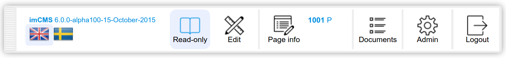
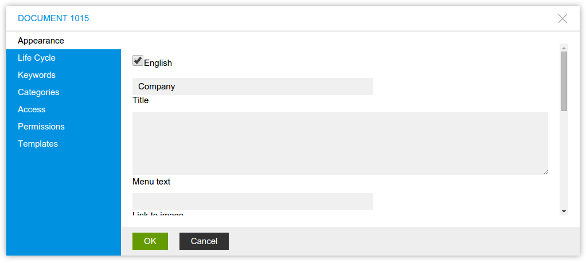

Templates
=========

*Describes how to create/modify templates in ImCMS*

In this article:
	- `Create new template`_
	- `Modify template`_
	- `Summary`_

Create new template
-------------------

1. Create new file with ``jsp`` extension in **"tomcat/webapps/imcms/WEB-INF/templates"**.

2. Add follow code to created file

.. code-block:: jsp

    <!DOCTYPE html>
    <html xmlns="http://www.w3.org/1999/xhtml" xml:lang="en" lang="en">
    <head>
        <title>Template</title>
        <meta charset="utf-8"/>
    </head>
    <body>
        Hello World with New Template!
    </body>
    </html>
	

3. Restart **Tomcat**, run browser and in address line input ``http://localhost:8080/imcms``.

4. Login into ImCMS as Admin. Open Sign In window and type in login field ``admin`` and in password field ``admin``

.. image:: templates/_static/01-SingIn.png

5. Find **Admin Panel** on page and click button with label **Page info**

6. In opened window choose **Appearance** tab, scroll down to field with name **Template**.

7. Choose created template from dropdown and click **"OK"** button

---------------
---------------
Modify template
---------------

Since all templates locate in path **"/WEB-INF/templates"** everything that needed is open this folder and edit needed template.

Summary
-------

You can create and modify template in simple way. All templates locate in path **"/WEB-INF/templates"**. 

Related Resources
^^^^^^^^^^^^^^^^^

- :doc:`ImCMS tag engine </tag-engine/index>`.
