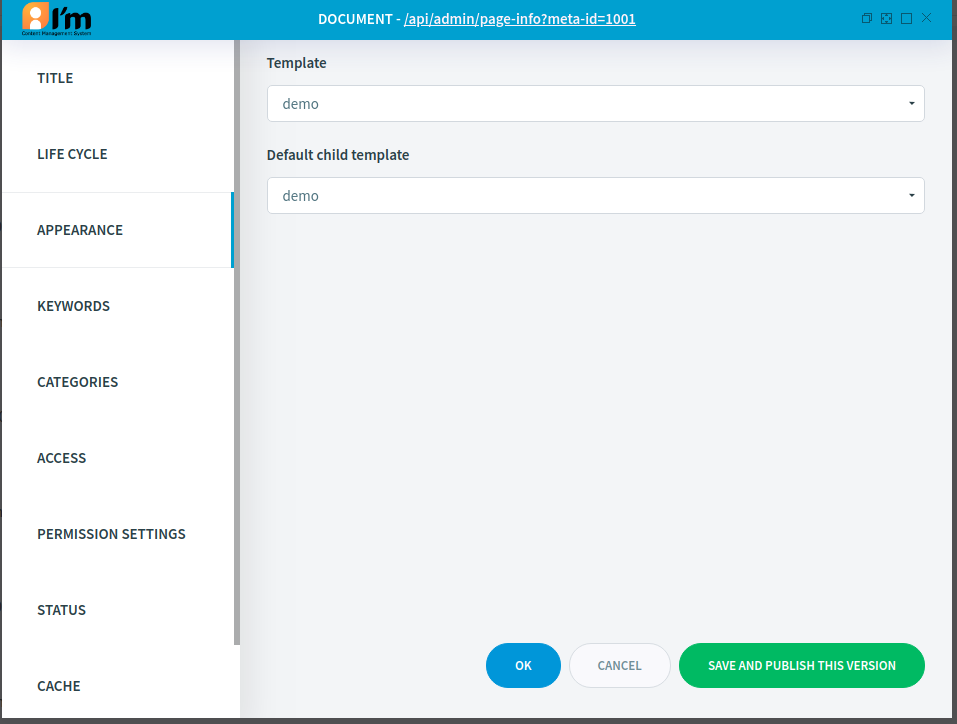
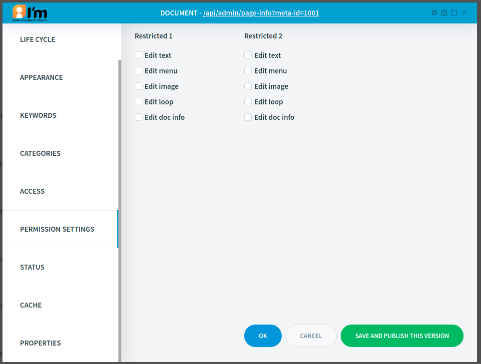

Text Document Management
========================

In this article:
    - `Introduction`_
    - `Edit Templates`_
    - `Edit Permissions`_

------------
Introduction
------------

This article describes basic text document configuration.

--------------
Edit Templates
--------------

ImCMS provide base document managing, that help change document status. There are 3 types of life cycle exists:

- In Process - it is mean that document has just been crated and it is preparing now.
- Approved - this status says that document is ready to use.
- Disapproved - document is disabled, and cannot be accessed.

----------------
Edit Permissions
----------------

This section provide access to configuring custom permission sets those mentioned in :doc:`Base </content-management/document/base>` section.

