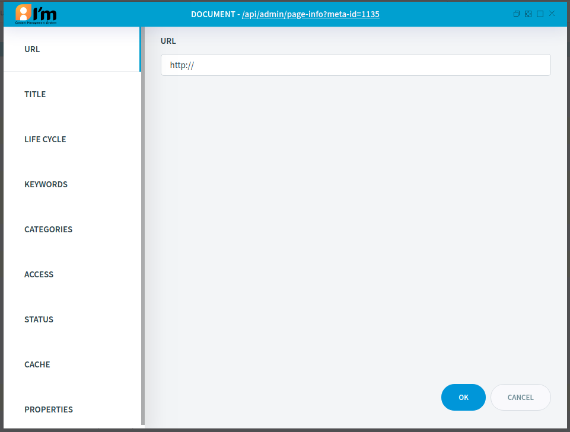

Url Document Management
=======================

In this article:
    - `Introduction`_
    - `Edit Linking`_

------------
Introduction
------------

This article describes basic url document configuration.

------------
Edit Linking
------------

ImCMS provide own section in base editor for file document. It provides access to edit document`s link.

