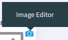

Image Management
================

In this article:
    - `Introduction`_
    - `Open Editor`_
    - `Using Editor`_
    - `Cropper_Editor`_

------------
Introduction
------------

ImCMS 6 provide feature - on-place image-editor, that can help easily change image on page.

-----------
Open Editor
-----------

- First enable **Edit Mode**.

-
    To open image editor Find of the page label with text **Image Editor** (as shown below)
    and click on it to open the editor.

------------
Using Editor
------------

There are several base part are in the image editor:

    - ``Image Viewer`` - it includes scaled or full size image with image crapper over it.

    .. image:: image/_static/02-ImageViewerPart.png

    - ``Image Info`` - set size to image editor, it provide information about image size, relative path to image etc.

    .. image:: image/_static/04-ImageInfoPart.png

#.

    - ``Select Image`` - presented as button that open File-Content Manager.

#.
    Enable/disable proportion flag for image:

    .. image:: image/_static/flag-proportion.png

#.
    Increase zoom for image:

    .. image:: image/_static/zoom-plus.png

#.
    Decrease zoom for image:

    .. image:: image/_static/zoom-minus.png

#.
    Precent proportion size for image:

    .. image:: image/_static/size-procent.png

#.
   Revert to original size image:

    .. image:: image/_static/revert-to-original.png

#.
    Fit image image without any borders in image area:

    .. image:: image/_static/fit-flag.png

#.
    To open rotate window:

    .. image:: image/_static/rotate-image.png

#.
    To open cropping window:

    .. image:: image/_static/cropping-image.png

#.
    Revert to original preview size image:

    .. image:: image/_static/revert-to-original.png

--------------
Cropper_Editor
--------------

 - ``Image Cropper`` - part of Image Viewer, the main function of it it is crop image. All features of it shown on image bellow.

    .. image:: image/_static/03-ImageCropperPart.png

 Imcms has a new feature for control cropping:

   - ``Cancel`` - close the window cropper image editor.
   - ``Remove cropping`` - revert to previous cropping image;
   - ``Rest to original`` - revert to original cropping area;
   - ``Crop`` - size w/h for current cropped image area;

