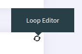
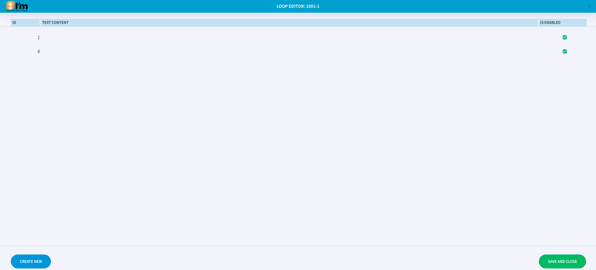

Loop Management
===============

In this article:
    - `Introduction`_
    - `Open Editor`_
    - `Using Editor`_

------------
Introduction
------------

ImCMS 6 provide feature - on-place loop-editor, that can help easily mange loop content on page.

-----------
Open Editor
-----------

- First enable **Edit Mode**.

-
    To open image editor Find on the left side of the page blue label with text **Loop Editor** (as shown below)
    and click on it to open the editor. When label hovered - the linked loop area is highlighted.

------------
Using Editor
------------

Since *Loop* it is just a cycle`s realization all managing reduces to adding or removing content iteration.4

