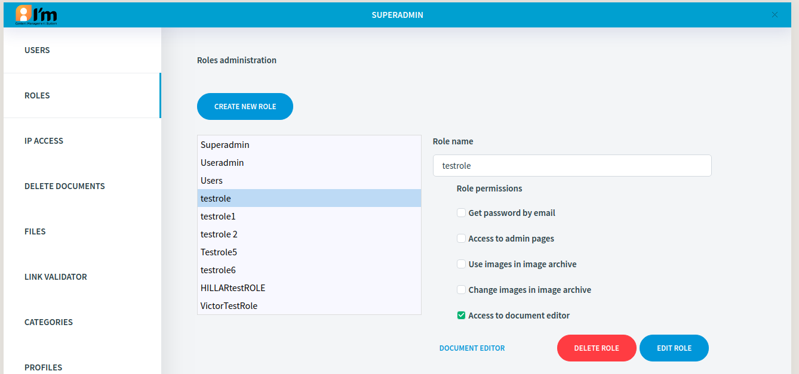
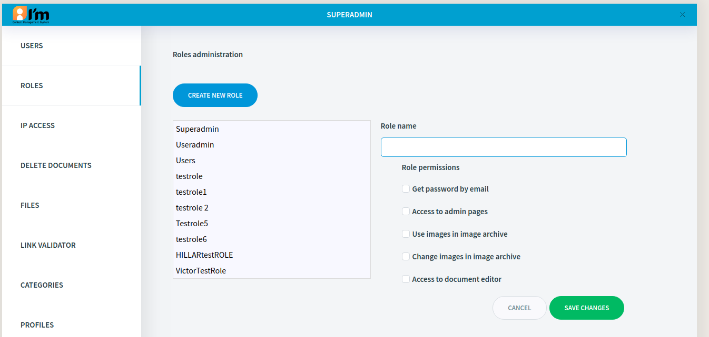
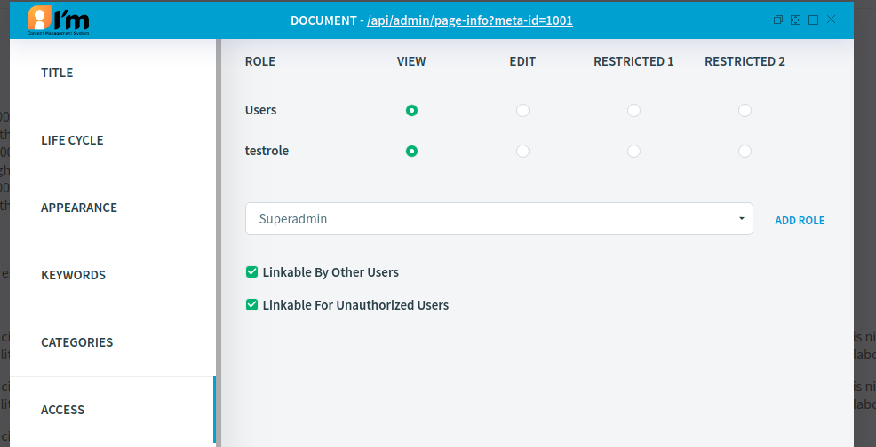
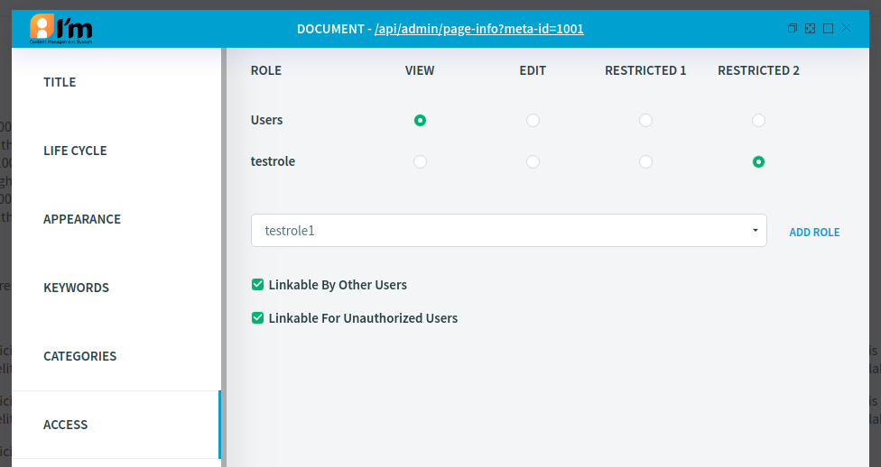
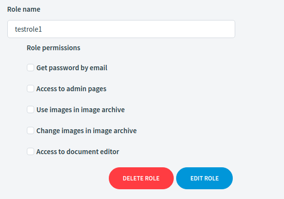

Role Management
===============

In this article:
    - `Introduction`_
    - `Create Role`_

------------
Introduction
------------

To classify users in the system ImCMS provide well known things that called **Role**. Also roles coupled with permissions
and give each group of users that have special role some permission set.

-----------
Create Role
-----------

Role editor located on address ``<domain-name>/servlet/AdminRoles`` and looks like on figure below.

To create new role click on button ``Create new role``, then, in opened window fill name of new role and choose basic permissions.

After the role has been created open PageInfo dialog and open *Access* section as has shown below.

Remove role **Users** if it has been presented and add created role from the list.

Delete selected role from system - to press red button **delete**

