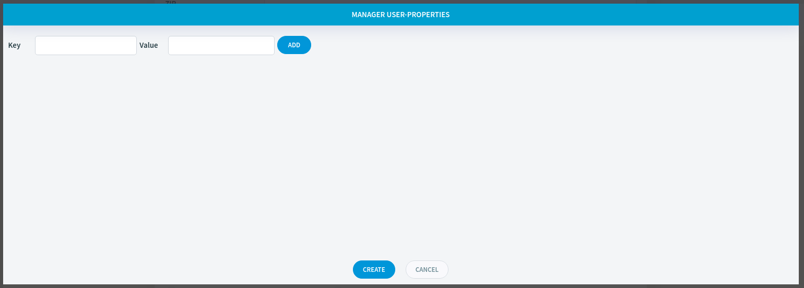

User Property Management
========================

In this article:
    - `Introduction`_
    - `Open Editor`_
    - `Using Editor`_

------------
Introduction
------------

ImCMS 6 provide feature - on-place user-properties editor, that can help easily change property for current selected user.

-----------
Open Editor
-----------

.. warning:: System allows create new user properties only for CREATED user!

- Go to Admin panel , and selected from list users one user, to open User administration form, and to press button `properties`

------------
Using Editor
------------

There are several base part are in the user properties editor:

    - ``Add key-value`` - To add list user properties like key/value (BUT don't saving, just prepare create list properties)

    .. image:: user-property/_static/add-properties.png

    - ``Create list properties for user`` - Create/Save all added list properties for the user (to press button CREATE on the footer)

    .. image:: user-property/_static/create-cancel.png

    .. warning:: Edit and delete user properties can only when their were created!

    - ``Edit, delete property`` - edit(pen), delete(cross) current selected property

    .. image:: user-property/_static/edit-delete.png

