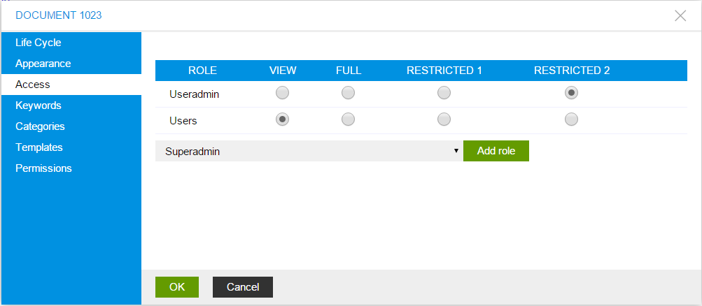

First Web Site
==============

#. Follow the :doc:`setup guide </getting-started/index>` to run ImCMS.

#. Now, if everything is ok you will get next page:

    .. image:: images/imcms-start-page-example.png

   it means that ImCMS system has started and now working perfectly.

#. Lets login as admin. Go to ``/login`` (don't miss context path if such exist). By default login and password is the same - ``admin``

#. If everything is okay you will see same page, but with **Admin Panel** (see :doc:`Admin Panel </content-management/admin-panel>` section).

    .. image:: first-web-site/_static/03-PageWithAdminPanel.png

#.
    Lets create new document. Click on Admin Panel **Document List** and follow :doc:`Document Management </content-management/document/index>` guide.

#.
    It is good, if document has been created, but nobody know, except you, about it, soo let's add created document to menu.
    To add document to menu consider :doc:`Menu Management </content-management/menu>` topic.

#.
    Great - now you know how to create page and add it to menu, but you ask the question - 'How I should fill content on my new page'.
    This is the time to enable **Edit Mode** - edit mode give ability to edit all editable content on the page all editable element you can find on :doc:`Content Management</content-management/index>` section.
    Consider text editing, we try to write our first *Hello World*.

    .. |saveIcon| image:: first-web-site/_static/04-ApplyTextEditingIcon.png
        :width: 20pt
        :height: 20pt

    - Enable *Edit Mode*
    - Find on the left side of page label with text **Text Editor** and click it.
    - Put "Hello World"
    - On Text Editor panel find button with |saveIcon| icon and click it.
    - Reload page to be sure that text has been saved.

#.
    Now - everything in prepared but this page opened for every one and maybe you don`t want to show data on it.
    There are two things that helps you to prevent access to this page - close it for every one, or create special group of users.
    The better way is  creating group of users and give them permissions to view current page. Since users grouped by role lets create new
    role in system - this operation has been described in :doc:`Role Management </content-management/role>` section.

After the role has been created open PageInfo dialog and open *Access* section as has shown below.

Remove role **Users** if it has been presented and add created role from the list.

.. image:: first-web-site/_static/06-ChangedRolePermission.png

