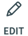
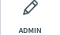
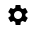

Admin Panel
===========

In this article:
    - `Introduction`_
    - `Panel Features`_

------------
Introduction
------------

ImCMS 6 provide new modern Admin Panel with several features.
In order to *get to the admin panel*, you need to *move the mouse up*, but you can change this in settings.

--------------
Panel Features
--------------

+--------------------+----------------------------------------------------------------------------------------------------------------+
+ |publicModeIcon|   + Public Mode - view the published version.                                                                      +
+--------------------+----------------------------------------------------------------------------------------------------------------+
+ |editModeIcon|     + Edit Mode - open the content editing mode of the working version.                                              +
+--------------------+----------------------------------------------------------------------------------------------------------------+
+ |previewIcon|      + Preview Mode - view a preview of the working version.                                                          +
+--------------------+----------------------------------------------------------------------------------------------------------------+
+ |publishIcon|      + Publish - publish a current document.                                                                          +
+--------------------+----------------------------------------------------------------------------------------------------------------+
+ |pageInfoIcon|     + Page Info - open the :doc:`Page Info</user-documentation/document-management/page-info/base>`.                 +
+--------------------+----------------------------------------------------------------------------------------------------------------+
+ |siteSpecific|     + Admin (optional) - open additional functionality written by the developer.                                     +
+--------------------+----------------------------------------------------------------------------------------------------------------+
+ |documentsIcon|    + Document Manager - open the :doc:`Document Manager</user-documentation/document-management/document-manager>`. +
+--------------------+----------------------------------------------------------------------------------------------------------------+
+ |adminManagerIcon| + Admin Manager - open the Superadmin page.                                                                      +
+--------------------+----------------------------------------------------------------------------------------------------------------+
+ |logoutIcon|       + Logout - logout current user from the system.                                                                  +
+--------------------+----------------------------------------------------------------------------------------------------------------+
+ |settingPanelIcon| + Setting panel - open admin panel settings.                                                                     +
+--------------------+----------------------------------------------------------------------------------------------------------------+