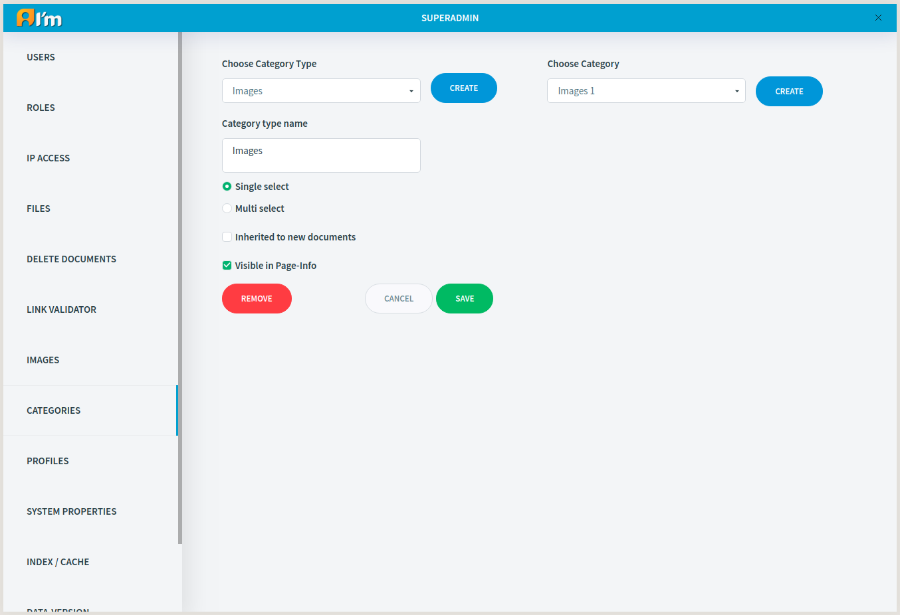

Category Management
=====================

In this article:
    - `Introduction`_
    - `Category Type Fields`_
    - `Category Fields`_
    - `Creation`_
    - `Editing`_
    - `Removal`_

------------
Introduction
------------

In order to classify elements in the system ImCMS provide categories.
The main concept is that the base type of categories is **Category Type**.
It can include several categories and applied for all elements in the system that support classifying (such as document).

+-----------------+
| |categoryType|  +
+-----------------+
+ |category|      +
+-----------------+

--------------------
Category Type Fields
--------------------

Each **Category Type** can be simple or complex. Simple category type provide only one category selecting, complex provide multiply category selecting.

**Category Type** has the following fields:

* **Name**

* **Select type**:

    * **Single select**- only one category can be selected from this category type.

    * **Multi select** - provide multiple category selecting.

* **Inherited to new documents** - enable inheritance for new documents, that is mean that all new documents, create from prototype document, inherited already chosen category for this category type.

* **Visible in Page-Info** - visibility of this category type and categories in *Categories* tab in *Page Info*.

---------------
Category Fields
---------------

**Category** has the following fields:

* **Category Name**

* **Description** - a short description of the category.

--------
Creation
--------

In order to create **Category Type**, you have to:

1. Click **Create** button.
2. Fill in fields.
3. Click **Save** button.

In order to create **Category**, you have to:

1. Select **Category Type** from the drop down list for which you want to create **Category**.
2. Click **Create** button that appears on the right.
2. Fill in fields.
3. Click **Save** button.

-------
Editing
-------

In order to edit **Category Type**, you have to:

1. Select **Category Type** from the drop down list.
2. Edit required fields.
3. Click **Save** button.

In order to edit **Category**, you have to:

1. Select **Category Type** from the drop down list.
2. Select **Category** from the drop down list that appears on the right.
3. Edit required fields.
4. Click **Save** button.

-------
Removal
-------

In order to edit **Category Type**, you have to:

1. Select **Category Type** from the drop down list.
2. Click **Remove** button.

In order to edit **Category**, you have to:

1. Select **Category Type** from the drop down list.
2. Select **Category** from the drop down list that appears on the right.
3. Click **Remove** button.