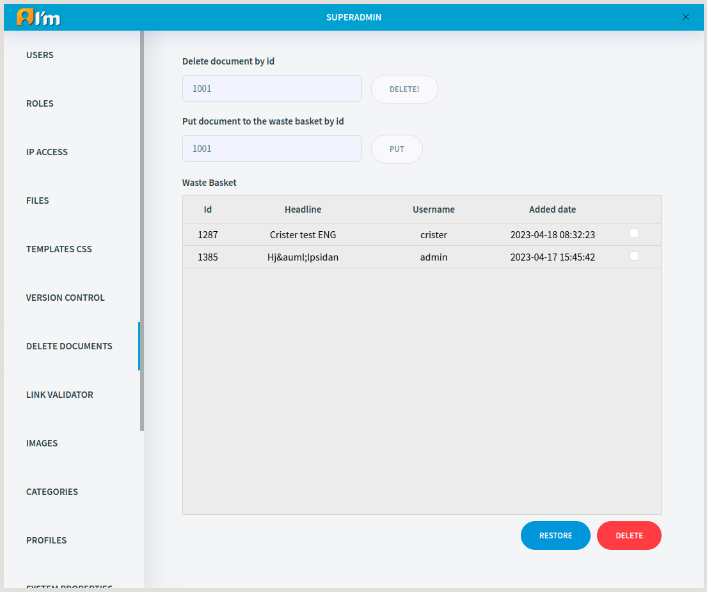

Deletion and Waste Basket
=========================

Using *Delete Documents* tab, you can delete the document, put it in or take it out of the Waste Basket.

.. note::
    Only superadmin can visit a document if it's in the Waste Basket.

    The document is stored in all menus until it's completely deleted.

In order to delete a document, you have to enter the document ID in the first input field and click **Delete** button.

In order to put a document in the waste basket, you have to enter the document ID in the second input field and click **Put** button.

In order to restore documents, you have to check the checkboxes in the rows and click **Restore** button below the list.

In order to delete documents from the basket, you have to check the checkboxes in the rows and click **Delete** button below the list.

.. seealso:: You can also delete and put in the Waste Basket using the :doc:`Document Manager</user-documentation/document-management/document-manager>`.
