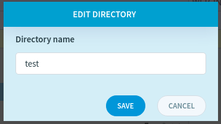

File Management
===============

In this article:
    - `Introduction`_
    - `File Operations`_
    - `Template Management`_

.. |pencil| image:: _static/icon/ic_text_editor.png
    :height: 12pt

------------
Introduction
------------

imCMS 6 provides the ability to manage project files.
The developer gives access to this tab only to certain users, and also gives access only to certain directories.

---------------
File Operations
---------------

The tables on the left and right are identical, this is a solution for convenience.

How to do basic actions on files:

* Enter a folder, view a file - double click.
* Return to previous folder - click **../**.
* Create a folder or file - click |add|.

* Rename a folder - click |pencil|.

* Upload a file - click |upload|.

* Rename a file - click |pencil|.
* Edit a file content - click |pencil|, enable **Edit file content** checkbox.

.. image:: _static/admin-files-editing.png

.. note:: You can edit the content of the SVG image.

* Download a file - click |download|.

* Copy a folder or file -
    1. select a folder/file in the table on the left.
    2. go to the folder to which it should be copied in the table on the right.
    3. click the **->** button under the title "Buttons for copy file".

* Move a folder or file -
    1. select a folder/file in the table on the left.
    2. go to the folder to which it should be moved in the table on the right.
    3. click the **->** button under the title "Buttons for move file".

* Delete a folder or file - click **X**.

-------------------
Template Management
-------------------

*Template* is a page layout. Every *Text* document has a *template*.

All templates are located in ``WEB-INF/templates/text``. You cannot move or copy files in this folder.

.. warning:: The template file must have one of the following extensions: ``jsp``, ``jspx``, ``html``.

In order to find out which documents use a particular template, click on it in the table.
You will see a list of documents below the table. You can click **VIEW** to open published page or **EDIT** to open the *Page Info*.

The system supports dynamic renaming and changing the content of the template.
So, you can edit the page layout and these changes will apply to all documents that have this template.

If you need to delete a template that is used in documents, the system will offer to replace it.
To do this, select one of the proposed templates in the window that appears and click **Save** button.

**************
Template Group
**************

Templates can be grouped into *Template Groups* so you can classify your templates.

To *create* a group you have to:

1. Click the create button in the template groups section under the table
2. Enter the desired group name
3. Push button

To *remove* a *template group*, select the group from the drop-down list and click **Remove** button.

To *add a template* to a group you have to:

1. Select the group from the drop-down list.
2. Click **+** on the template you need to add.

To *remove a template* from a group you have to:

1. Select the group from the drop-down list.
2. Find the required template in the list that appears.
3. Click **X**.
