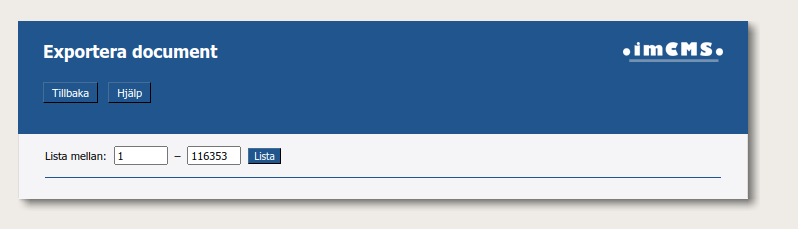
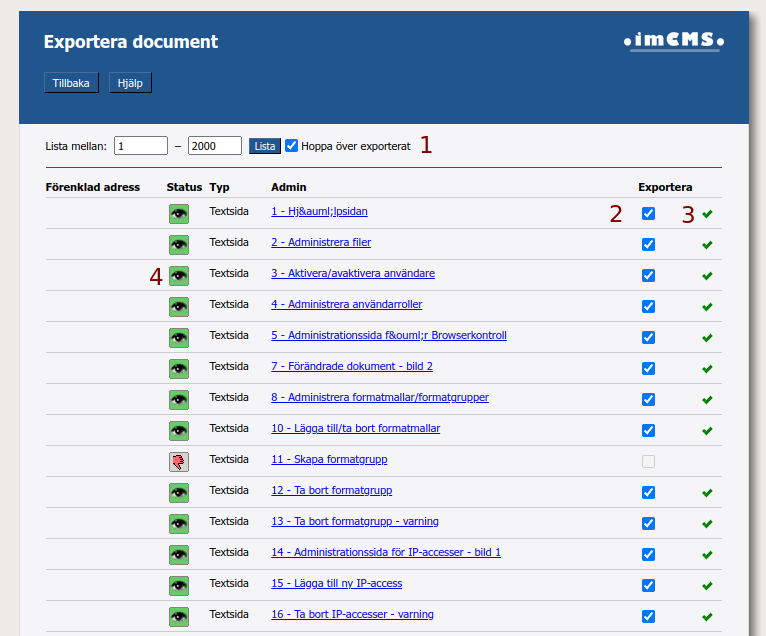
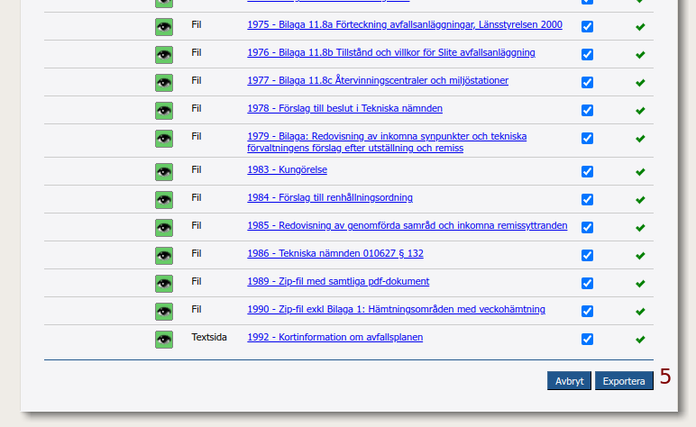
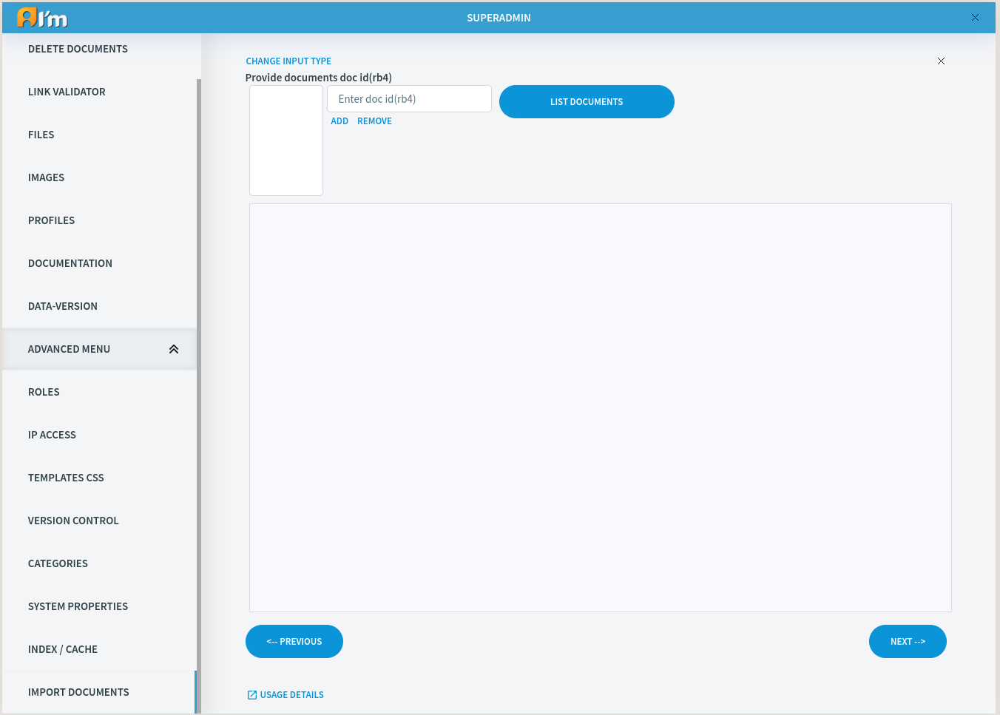
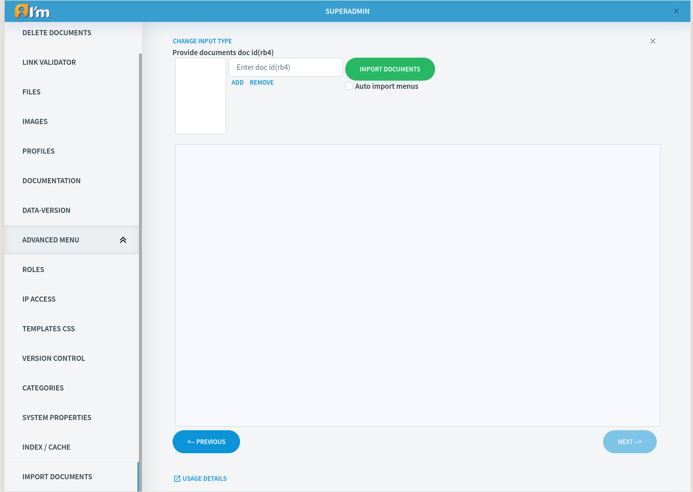

Export/Import Documents
=======================

In this article:
    - `Export Documents`_
    - `Import Documents`_

.. |upload| image:: _static/import/upload-button.png

.. |idRange| image:: _static/import/start-end-ids.png

.. |list-documents| image:: _static/import/list-documents-button.png

.. |filter| image:: _static/import/filter-options.png

.. |import-documents| image:: _static/import/import-documents-button.png

.. |successExport| image:: _static/import/success-export.png

.. |excludedExport| image:: _static/import/excluded-export.png

.. |failedExport| image:: _static/import/failed-export.png

.. |remove-alias| image:: _static/import/remove-alias-button.png

.. |replace-alias| image:: _static/import/replace-alias-button.png

----------------
Export Documents
----------------

**1. Navigate to AdminManager.**

**2. Select Exportera dokument(Export documents) and proceed to it.**

.. image:: _static/import/adminmanager-export-docs-tab.png

**3. Here specify range of documents(start id and last id). It is better to use small ranges because large ones will be longer to wait.**

**4. Export documents manager overview.**

1 - *Hoppa över exporterat( Skip exported)* – always turned on. When turned on skips already exported documents from export.

2 - Each document can be included/excluded from export. Checked -> export.
This value saved in database so every user that has access to this page will see it.

.. note:: Document will not be included in export if it is not published.

3 - Indicates document export status:

- |successExport| - means document successfully exported.
- |excludedExport| - means document has been excluded from export and was skipped during export.
- |failedExport| - means document failed to export. Something unexpected happened. Check logs.

.. note:: If document failed to export so during the next export system will try to export it again if it is included in export.

4 - Document status.

5 - *Exportera(Export)* button. Click and system will export document within range.

**5. Indicates that system exports documents. Wait until page reload and show summary page.**

.. image:: _static/import/export-progress-indication.png

**6. Summary page.**

.. image:: _static/import/summary-page-1.png

.. image:: _static/import/summary-page-2.png

1 - Export status.

2 - Download zipped exported documents in json format(export.zip).

----------------
Import Documents
----------------

.. image:: _static/import/import-tab.png

- **Upload documents** – Includes upload section where you can upload .zip.
- **Edit documents** – Sections without upload section.
- **Control alias** – Separated section where you can manage aliases.

************************
Upload documents section
************************

.. image:: _static/import/upload-documents-section.png

- **Upload documents button** used to upload .zip.
- **Dotted area** supports drag & drop.

**********************
Edit documents section
**********************

|list-documents| - used to show basic import documents info within range.

******************************
Edit import references section
******************************

.. image:: _static/import/edit-import-references-section.png

************************
Import documents section
************************

|import-documents| - used to import documents within range.

.. note::
    If no category or category type specified – then new one with import name will be created in system.

    If no role specified then new one will be created.

    If no template specified then default one will be used. User has to upload template by himself.

|idRange| - user can specify id range. Can be empty for list button(e.g. ...-…, 1-…, ...-999). Cannot be empty for import button. User has to specify range.

|filter| - used to filter basic import documents by status.

Import statuses:

- **IMPORTED** – means document imported and can be updated using UPDATE statuses.
- **UPDATE** – document will be updated from id.json file. You can import it many as many times as you want.
- **SKIP** – document will be skipped during import.
- **FAILED** – document importation failed. Check logs for more info.

*************
Control alias
*************

.. image:: _static/import/control-alias.png

|remove-alias| - removes the aliases within a given range (/import/1001 - /import/3400) for pages having an alias starting with /import.

|replace-alias|-  looks in all menus and text fields and replaces all links that has the prefix /import/ to the metaid on the new site. I.e. if the document 1234 is exported and the new page on RB6 is 1100, then all links that goes to /import/1234 should be replaced to /1100.
