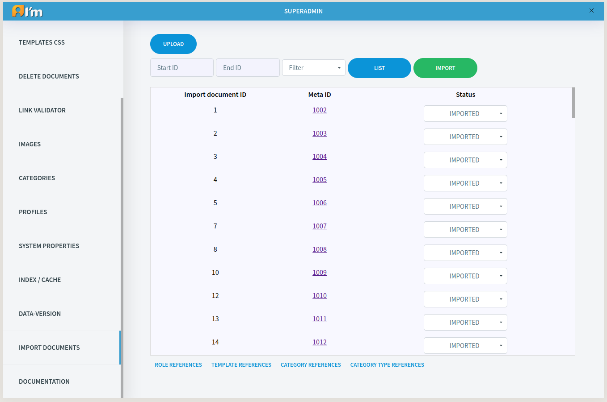
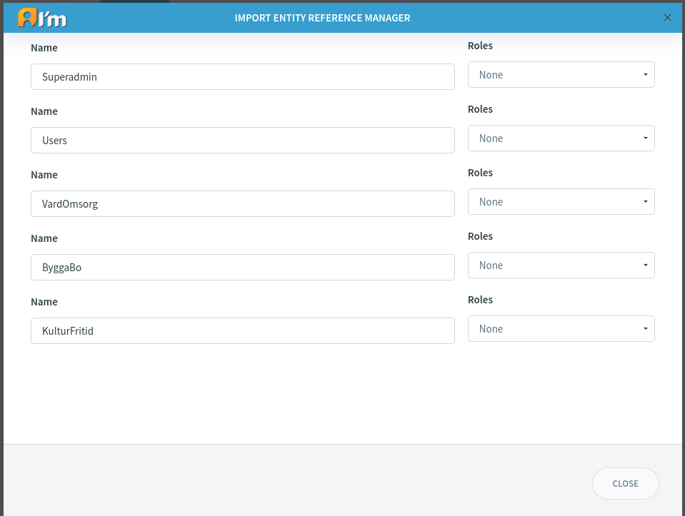

Import Documents
================

.. |upload| image:: _static/import/upload-button.png

.. |idRange| image:: _static/import/start-end-ids.png

.. |filter| image:: _static/import/filter-options.png

|upload| - used to upload zipped documents in json format.

|idRange| - user can specify id range. Can be empty for list button(e.g. ...-…, 1-…, ...-999). Cannot be empty for import button. User has to specify range.

|list| - used to show basic import documents info within range.

|filter| - used to filter basic import documents by status.

|import| - used to import documents within range.

*******************************
Import entity reference manager
*******************************

Import entity reference manager used for each import entity reference(role, category, category type, template).

.. note::
    If no category or category type specified – then new one with import name will be created in system.

    If no role specified then new one will be created.

    If no template specified then default one will be used. User has to upload template by himself.

Import statuses:

- **IMPORTED** – means document imported and can be updated using UPDATE statuses.
- **UPDATE** – document will be updated from id.json file. You can import it many as many times as you want.
- **SKIP** – document will be skipped during import.
- **FAILED** – document importation failed. Check logs for more info.
