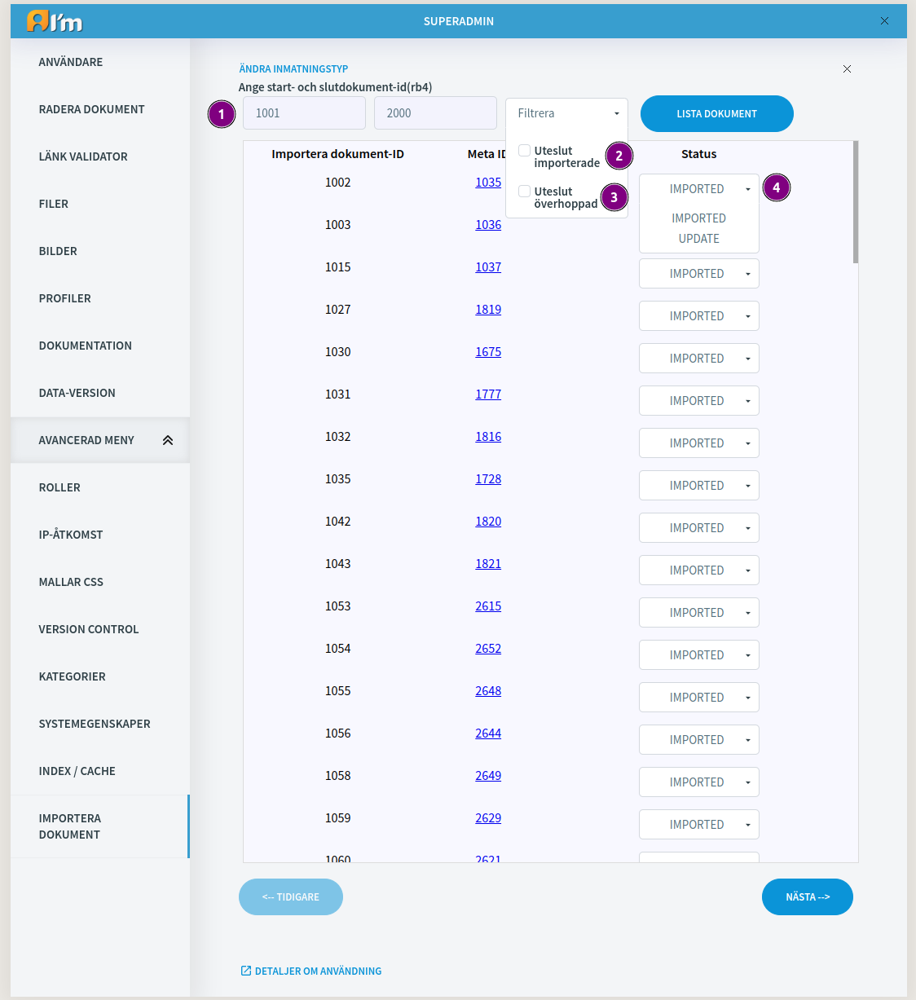
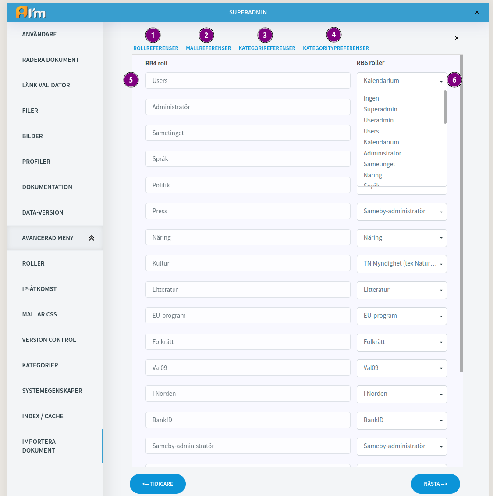

Export/Import Documents
=======================

In this article:
    - `Export Documents`_
    - `Import Documents`_

.. |upload| image:: _static/import/upload-button.png

.. |idRange| image:: _static/import/start-end-ids.png

.. |filter| image:: _static/import/filter-options.png

.. |successExport| image:: _static/import/success-export.png

.. |failedExport| image:: _static/import/failed-export.png

----------------
Export Documents
----------------

**1. Navigate to AdminManager.**

**2. Select Exportera dokument(Export documents) and proceed to it.**

**3. Here specify range of documents(start id and last id). It is better to use small ranges because large ones will be longer to wait.**

1 - *Change input type* - change the way you can list documents. Range or manually typed exact documents. 

2 - *Range* - where you define start and end ids.

3 - *List button* - press it and list documents withing the range.

1 - *Document id input* - write document id and press add button to add it. Also it supports pasting in space separated format(1001 1002 1003 ...) 

2 - *Add button* - add documetn id to list from input.

3 - *Remove button* - remove one or several selected document ids from list. (use ctrl to select several)

4 - *List* - list with document ids.

**4. Export documents manager overview.**

1 - Each document can be included/excluded from export. Checked -> export.
This value saved in database so every user that has access to this page will see it.

.. note:: Document will not be included in export if it is not published.

2 - Indicates document export status:

- |successExport| - means document successfully exported.
- |excludedExport| - means document has been excluded from export and was skipped during export.
- |failedExport| - means document failed to export. Something unexpected happened. Check logs.

.. note:: If document failed to export so during the next export system will try to export it again if it is included in export.

3 - *Hoppa över exporterat(Skip exported) button* – always turned on. When turned on skips already exported documents from export.

4 - *Exportera bilder(Export images) button*. Checked means export images with documents.

5 - *Exportera filer(Export files) button*. Checked means export files with documents.

6 - *Exportera(Export)* button. Click and system will export documents.

**5. Indicates that system exports documents. Wait until page reload and show summary page.**

.. image:: _static/import/export-progress-indication.png

**6. Summary page.**

1 - Export status.

2 - Download zipped exported documents in json format(export.zip).

----------------
Import Documents
----------------

- **Upload documents** – Includes upload section where you can upload .zip.
- **Edit documents** – Sections without upload section.
- **Control alias** – Separated section where you can manage aliases.

************************
Upload documents section
************************

- *Upload documents button* used to upload .zip.
- *Dotted area* supports drag & drop.

**********************
Edit documents section
**********************

1 - *List documents*.List selected documents.

2 - *Add*. Add document to list from input.

3 - *Remove*. Remove one or several selected documents from list.

4 - *List*. List with document ids.

5 - *Document id input*. Supports pasting with space separated document ids.(1001 1002 1003 ...)

6 - *Document status*. Changeable. On this tab you can change document status.

.. note:: Import statuses:

- **IMPORTED** – means document imported and can be updated using UPDATE statuses.
- **UPDATE** – document will be updated from id.json file. You can import it as many times as you want.
- **SKIP** – document will be skipped during import.
- **FAILED** – document import failed. Check logs for more info.

1 - *Range documents*. Document ids range. Define start and end. Both could be empty -> list all available documents.

2 - *Skip imported*. Don`t show imported documents.

3 - *Skip skipped*. Don`t show skipped documents.

4 - *Document status*.

******************************
Edit import references section
******************************

1 - *Role references*. Section with local and import roles.

2 - *Template references*. Section with local and import templates

3 - *Categories references*. Section wtih local and import categories.

4 - *Category types references*. Section wtih local and import category types.

5 - *Import entity reference(from rb4)*. Unchangeable.

6 - *Local entity reference(from current rb6 project)*. Select proper local(rb6) to import(rb4) reference.

.. note::
    Defined references are in use during import. e.g. rb4 role sametinget has reference to rb6 role sametinget-rb6. It means system automaticaly assign role sametinget-rb6 if find find roles sametinget-rb4. It works with all other references. 

    If no category or category type specified – then new one with import name will be created in system.

    If no role specified then new one will be created.

    If no template specified then default one will be used. User has to upload template by himself.

************************
Import documents section
************************

1 - *Import documents*. Import defined documents.

2 - *Auto import menus*. Unchecked by default. During documents import system will try to import menus. If this unchecked then system import only documents in menus that are already imported. If document is not imported yet system skip it. If this checked system will try to recusively import documents from menu. 

e.g. document 1001 has menu with documents [1002, 1003, 1004]. 1002, 1003 - imported. 1004 - not imported.

*Unchecked*.  System will add 1002, 1003 to menu because they are already imported. 1004 will be skipped and this document will not be in menu.

*Checked*. Systeam will add 1002, 1003 because they are already imported. And system will try to import 1004 document. On success it will be added to menu. 

*************
Control alias
*************

|remove-alias| - removes the aliases within a given range (/import/1001 - /import/3400) for pages having an alias starting with /import.

|replace-alias|-  looks in all menus and text fields and replaces all links that has the prefix /import/ to the metaid on the new site. I.e. if the document 1234 is exported and the new page on RB6 is 1100, then all links that go to /import/1234 will be replaced to /1100.
