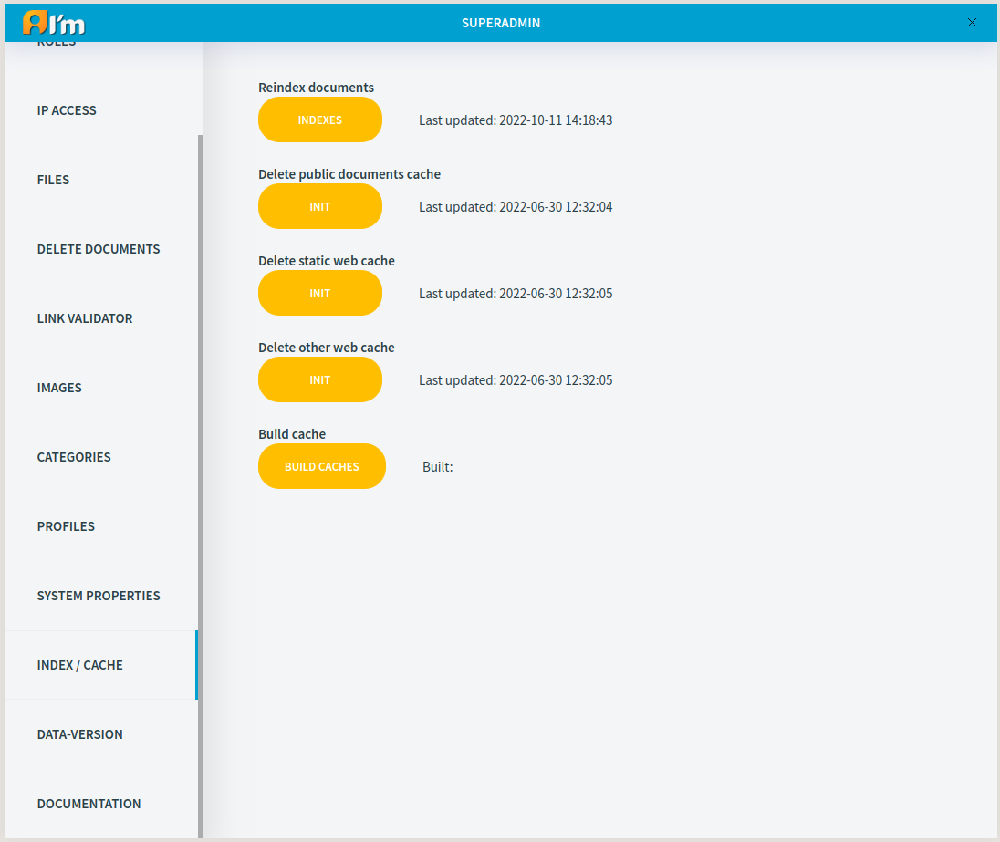

Index and Cache Management
==========================

ImCMS uses indexing technology to quickly find documents, files, etc. and caching technology to speed up the system.

**Reindex documents** - you can try to reindex all documents in the system if you have some problem while searching.

**Delete public documents cache**, **Delete static web cache**, **Delete other web cache** - you can try delete cache if the content on the page is not updated after changing it.

**Build cache** - you can build a new cache after deleting it.

**Last updated** - last date the action was taken.
