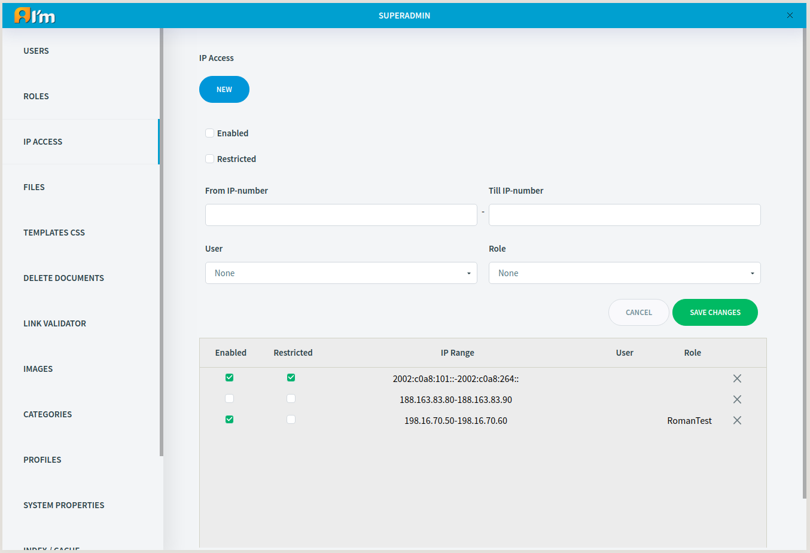

Ip Access
=========

In this article:
    - `Introduction`_
    - `Rules and Access Check Algorithm`_
    - `Rule Management`_

------------
Introduction
------------

ImCms provides the ability to restrict / allow authorization by IP addresses (maintains both ipv4 and ipv6).

**Enabled** checkbox - enable/disable the rule.

**Resticted** checkbox - restrict/allow authorization in the specified range of IP addresses.

.. note:: You can create both blacklist and whitelist.

You can restrict/allow authorization in the IP range for a specific user, for a specific role, or for all users
(to do this, don't select the user or role).

.. warning:: If you select **user** and **role** together, this rule separately applies to selected user and users with selected role.

--------------------------------
Rules and Access Check Algorithm
--------------------------------

Restricted rule - the user who is within the specified range does not have access.

Unrestricted rule - the only user who is within the specified range has access.

Steps to check access by IP:

1. Check restricted rules. Access is restricted if the user is within the IP range and meets one of the following conditions:

  * the rule doesn't specify the user and role.

  * the user in the rule and the current user are the same.

  * the current user has the role specified in the rule.

2. Check unrestricted (restricted checkbox is disabled) rules.

  2.1 Select all unrestricted rules in which the user or role matches the current user.

    2.1.1 If there are such rules, go to 2.1.2. Otherwise, go to 2.2.

    2.1.2 If at least one rule is unsatisfactory, access is denied. Otherwise, access is allowed.

  2.2 Select rules for all users (user or role not specified). If at least one rule is unsatisfactory, then access is denied. Otherwise, access is allowed.

---------------
Rule Management
---------------

In order to **create** the rule, you have to:

1. Click **New** button.
2. Fill in **Enabled**, **Restricted** checkboxes and **From IP-number**, **Till IP-number** inputs (you can leave out **Till IP-number** and the rule will be applied to only single address).
3. (optional) Select **User** and/or **Role**.
4. Click **Save Changes** button.

In order to **edit** the rule, you have to:

1. Click on the selected rule in the table.
2. Edit fields.
3. Click **Save Changes** button.

In order to **delete** the rule, you have to click **X** button in the selected rule field in the table.
