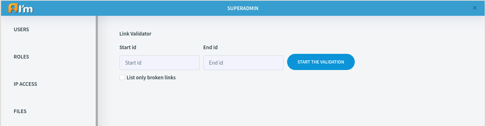
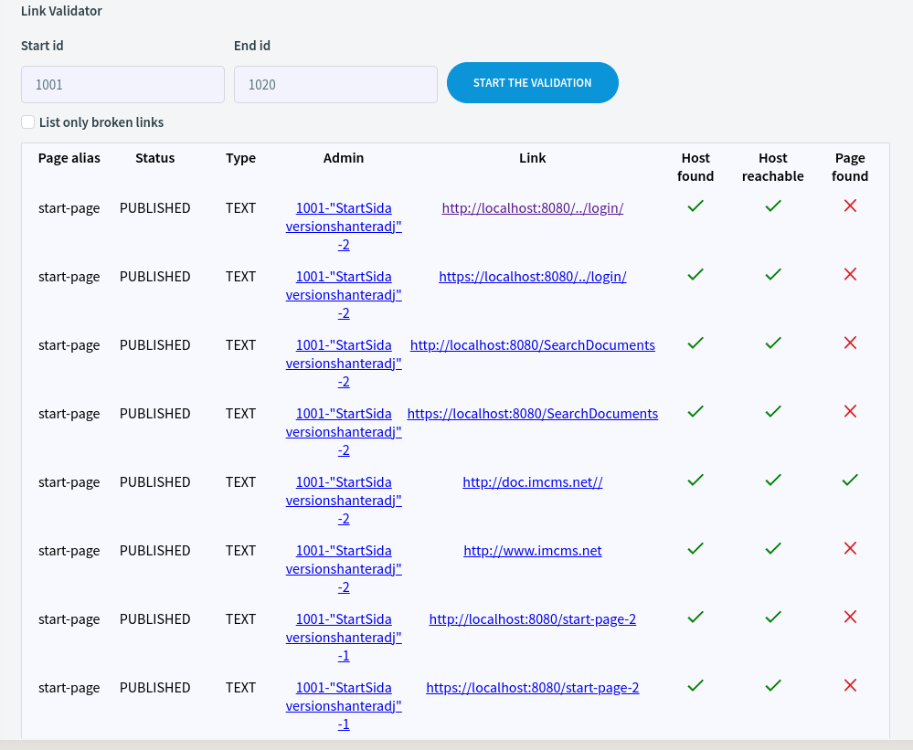

Link Validator
==============

**Link Validator** – is a tool that validate links on entire document.

In order to start validation you need to provide document range(e.g. 1001-1001, 1001-1010).
Also you can view only broken links if set appropriate flag.

Here you can see the validation result:

You can press any link under *Admin* column and you will be redirected to the place where this link written.