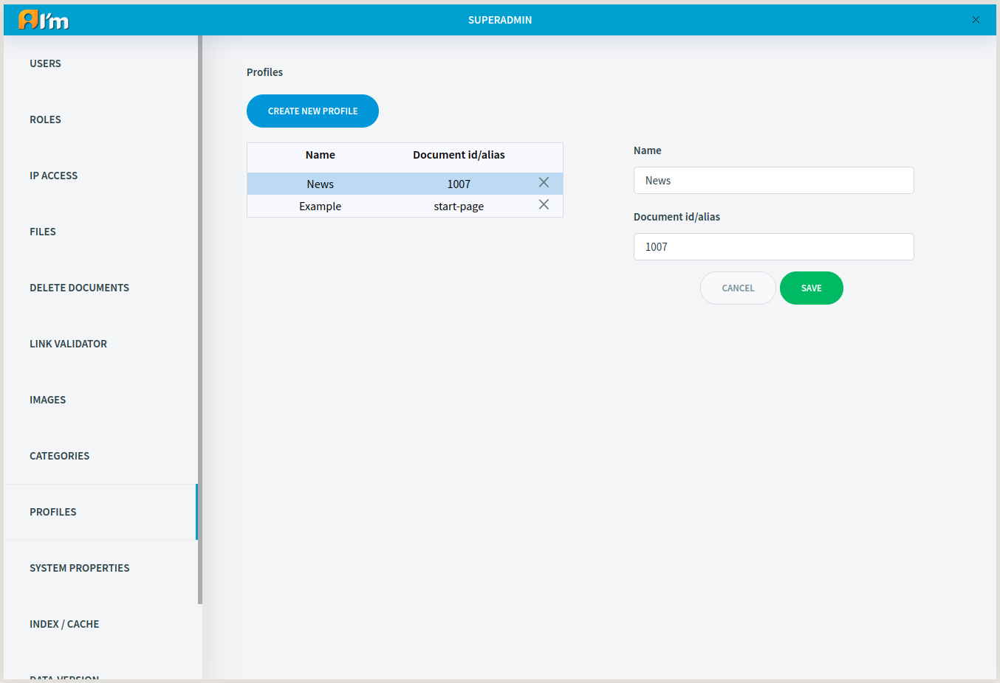

Profile Management
==================

In this article:
    - `Introduction`_
    - `Creation`_
    - `Editing`_
    - `Removal`_

------------
Introduction
------------

**Profile** is used to facilitate :doc:`document creation </user-documentation/document-management/document-manager/#document-management>`.

**Profile** has the following fields:

* **Name**.

* **Document id/alias**.

--------
Creation
--------

In order to create profile, you have to:

1. Click **Create new profile** button.
2. Fill in fields.
3. Click **Save** button.

-------
Editing
-------

In order to edit profile, you have to:

1. Click on the required profile in the list.
2. Fill in fields.
3. Click **Save** button.

-------
Removal
-------

Click **X** on the required profile in the list.
