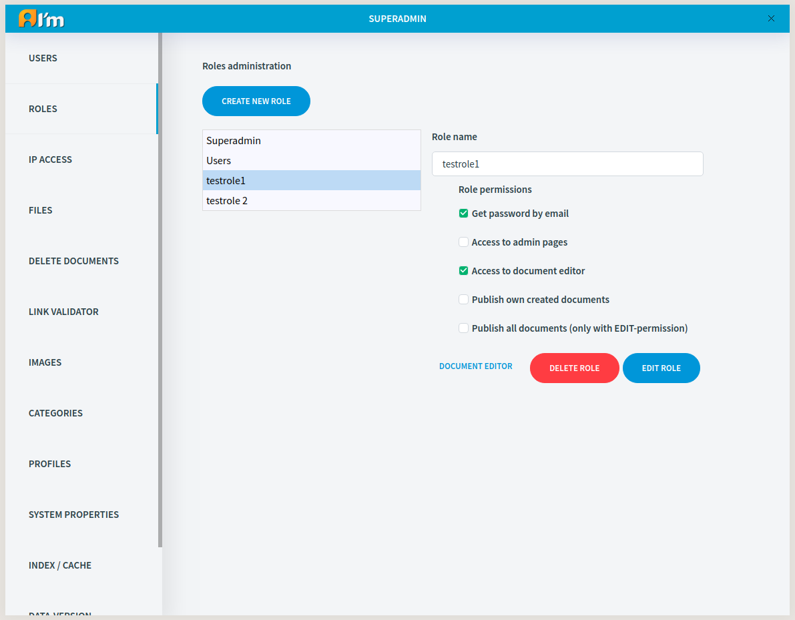

Role Administration
===================

In this article:
    - `Introduction`_
    - `Role Management`_

------------
Introduction
------------

ImCMS 6 provides flexible access control. A role is used to classify users and grant them certain permissions.

* **Get password by email** - gives access to recover password by sending confirmation code to email (Login page -> *Forgot password* button).

* **Access to admin pages** - gives access to the *Site Specific* tab and the *Admin page*, but with limitations.
    * No access to *Ip Access*, *Version Control*, *Files*, *Profiles*, *System Properties*, *Import Documents*, *Documentation* tabs.
    * *Users* tab - a user with this permission cannot edit superadmins and doesn't see them when searching. Also, a such user cannot give the *Superadmin* role when creating/editing.
    * *Delete Documents* tab - a user with this permission has not access to the Waste Basket.

* **Access to document editor** - gives access to the *Document Manager*. But only the user with the necessary document permission (*EDIT* or *Edit doc info*, see below) can open the *Page Info* of a specific document.

* **Publish own created documents** - the user can publish own documents.

* **Publish all documents (only with EDIT-permission)** - the user can publish any document if he has EDIT permission for the document.

.. seealso:: Read more about access control :doc:`here </user-documentation/access-control>`

---------------
Role Management
---------------

When we view roles with *document editor* permission it have an additional **Document editor** button.
By clicking on it, you go to the *Document manager*, but with permissions for this role.
This way you can see which documents will be visible for this role.

********
Creation
********

In order to create a role, you have to:

1. Click **Create new role** button.
2. Enter name and enable necessary permissions.
3. Click **Save changes** button.

********
Editing
********

In order to edit a role, you have to:

1. Click on the selected role in the list.
2. Click **Edit role** button.
3. Edit fields.
4. Click **Save changes** button.

*******
Removal
*******

1. Click on the selected role in the list.
2. Click **Delete role** button.
