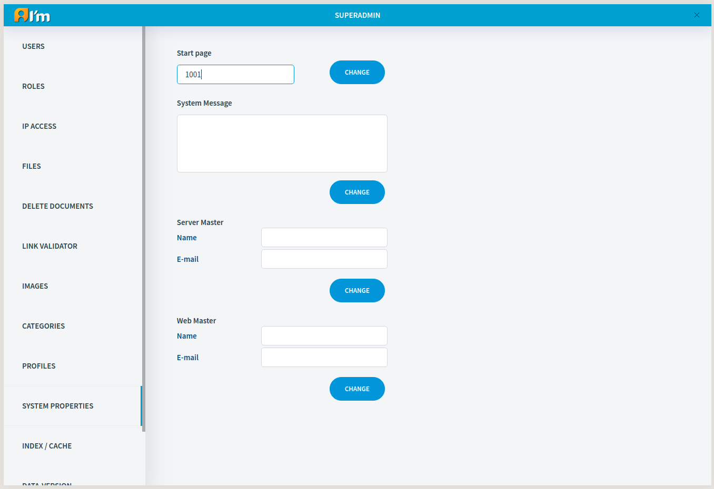

Managing System Properties
==========================

**Start page** - id of the document that is the opening page of the site.

**Server Master Email** - 1.the user can write a bug report to this email address when he gets a 404 error page, 2. the email that is used when sending the password recovery code to the user.

