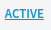

Template CSS
============

In this article:
    - `Introduction`_
    - `Template CSS Management`_
    - `Preview`_

------------
Introduction
------------

*Template CSS* – is a CSS code that applies to document which has appropriate template.

-----------------------
Template CSS Management
-----------------------

Firstly you need to enable template CSS support. You need to use ``<imcms:templateCSS/>`` tag.

.. warning:: It is important to place It under ``<imcms:admin/>`` tag because you might want that your styles will not be overwritten.

*******************
Template CSS Editor
*******************

1. In order to start work with template CSS you need to choose template.

2. You have two buttons:

|active| - shows active version of template css. Active means that all users see changes.

|working| - shows working version. Working means no one can see changes. In order to preview them see *Appearance* tab in *Page Info*.

You only can change working version.

3. When you load working version you will see another useful buttons:

**History** button - loads chosen template`s CSS history.

**Publish** button - publish working version.

**Save** button - save working version.

**Clear** button - clear working space.

.. note:: Remember that you need to provide changes in order to save working version. Also you cannot publish if versions match.

********************
Template CSS History
********************

Here you can load history of template CSS and choose it to work with by pressing **Use** button.

-------
Preview
-------

When you have published version of template css you can visit document and you will see changes.

You can preview template css layout using appropriate button in *Appearance* tab in *Page Info*.

Press it and working version of template css will be applied on current document. Reload and changes gone.

