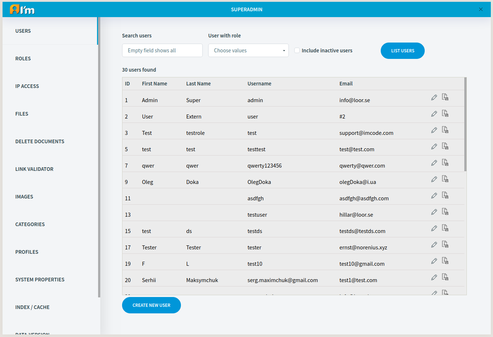
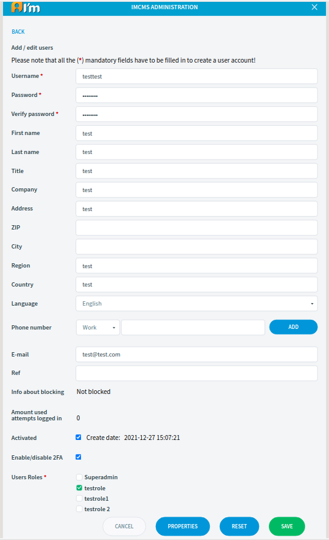
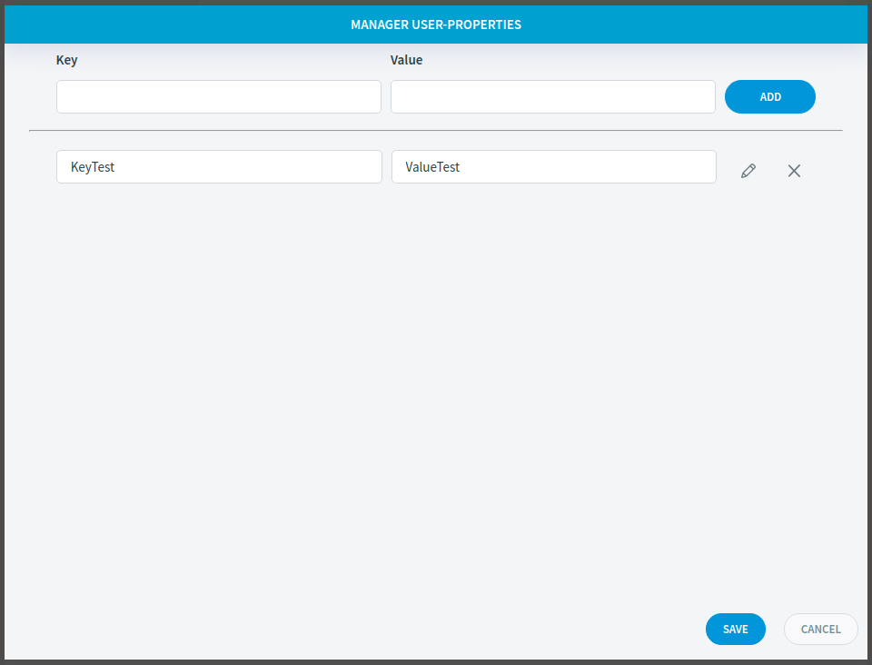

User Administration
===================

In this article:
    - `User Search`_
    - `User Management`_
    - `Managing User Properties`_

.. |pencil| image:: _static/icon/ic_text_editor.png
    :height: 12pt

-----------
User Search
-----------

In order to search for users you have to fill in the filter fields (it's optional) and click **List users** button.

Filter fields:

* **Search users** - the text that will be searched for in following fields: username, first name, last name, email, title, company.
* **User with role** - include only users with a specific role.
* **Include inactive users** - include/exclude inactive users in the result.

.. warning:: Only superadmins see superadmins while searching.

---------------
User Management
---------------

**Username** and **Password** will be used later to log in to the system. So **Username must be unique**.

.. warning:: Only superadmins can give and remove the superadmin role.

What roles are and how it affect you can read in the article :doc:`Access Control</user-documentation/access-control>`.

*********
Creation
*********

In order to create a user, you have to:

1. Click **Create new user** button.
2. Fill in fields.
3. Click **Save** button.

*******
Editing
*******

The *administrator* can edit a user by following these steps:

1. Search users.
2. Click |pencil| on the selected user in the list.
3. Edit required fields.
4. Click **Save** button.

.. note:: The user can edit his account, but with restrictions.

The *user* can edit his account by following these steps:

1. Go to login page.
2. Enter username and password.
3. Click **Edit profile** button.
4. Edit required fields.
5. Click **Save** button.

************
Deactivation
************

The user can be deactivated, in such case the account becomes unusable.

You can deactivate a user in following ways:

* Go to user edit page and disable **Activated** checkbox.
* Click |archive| on the selected user in the list.

------------------------
Managing User Properties
------------------------

*User Properties* can be used for certain features that a developer may have added to the code.

*********
Creation
*********

In order to create a user property, you have to:

1. Go to user edit page.
2. Click **Properties** button.
3. Add values.
4. Click **Create** button.

.. warning:: System allows create new user properties only for CREATED user!

*******
Editing
*******

In order to edit a user property, you have to:

1. Go to the property manager.
2. Click |pencil|.
3. Edit fields.
4. Click |ok|.
5. Click **Save** button.

*******
Removal
*******

In order to remove a user property, you have to:

1. Go to the property manager.
2. Click **X**.
3. Click **Save** button.
