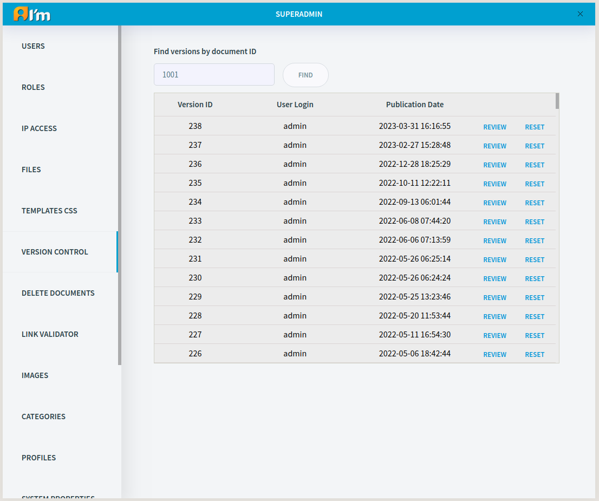

Version Control
===============

ImCMS 6 provides the ability to manage document versions.

.. seealso:: First read the *Document Versioning* section in the :doc:`Basic Information</user-documentation/base-info>` article.

You can view and restore previous published versions using *Version Control* tab.

In order to view the list of versions, you have to enter the document ID in the input field and click **FIND** button.

In order to preview a document page and Page Info of a previous version, you have to click **REVIEW**.

In order to restore previous version, you have to click **RESET**. You should publish the document to make changes visible to regular users.

.. warning:: Resetting a version removes the content from the working version and keeps it from the selected version. For example, if the text field did not exist in the previous version, then this field will be empty.
