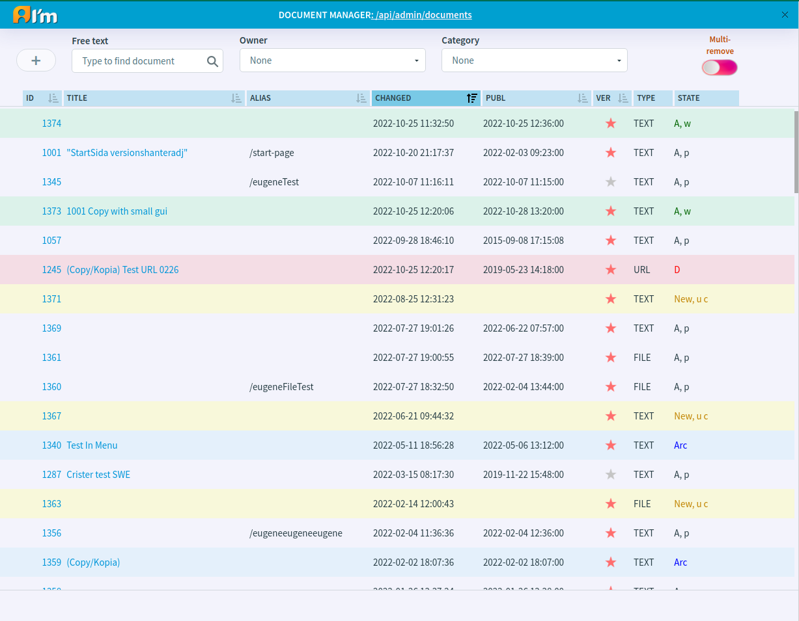
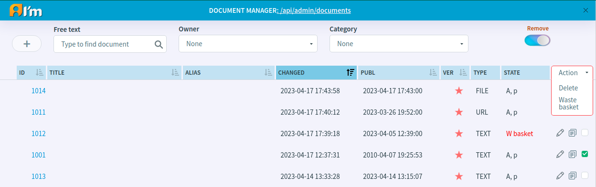

Document Manager
==================

In this article:
    - `Introduction`_
    - `Document Management`_

.. |pencil| image:: _static/ic_text_editor.png
    :height: 12pt

------------
Introduction
------------

The *Document Manager* displays all documents sorted by date modified.
You can change the order and sorting by clicking on the heading of a column.
Besides, you can change the search results by entering some free text, selecting the owner of the document
or the category which the document should have (take a look at the fields above the table).

.. warning:: The user may not be able to see all documents due to lack of permissions. Also a document may be search disabled.
             How permissions affect you can read in the article :doc:`Access Control</user-documentation/access-control>`.

---------------
Document Management
---------------

***************
Create Document
***************

In order to create a new document, you have to:

1. Click **+** button.
2. In the open window, select the document type and click **Ok**.
3. Choose a profile (more details :doc:`here </user-documentation/admin-settings/profiles>`) or a document id/alias that will be inherited for the current document and click **Create**.
4. Click **Ok** after filling in the required fields in the page info.

*************
Edit Document
*************

To edit a document, you have to move the mouse over the document and click |pencil| that appears.

*************
Copy Document
*************

To copy a document, you have to move the mouse over the document and click |copy| that appears.

***************
Remove Document
***************

In order to remove documents or put it in the waste basket, you have to:

1. Enable **Remove** switch button.
2. Select the necessary documents.
3. Click **Actions** and select the desired action.

.. seealso:: See more information in :doc:`Deletion and Waste Basket</user-documentation/admin-settings/delete-documents>` article.
