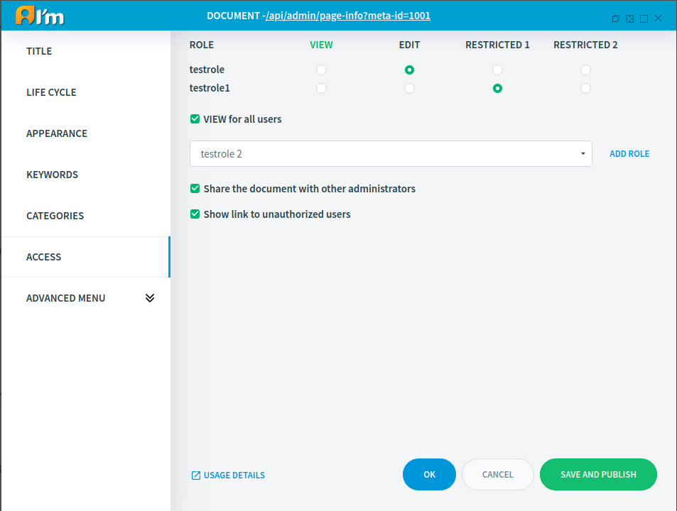

Base Management
===============

In this article:
    - `Introduction`_
    - `Title Tab`_
    - `Life Cycle Tab`_
    - `Keywords Tab`_
    - `Categories Tab`_
    - `Access Tab`_
    - `Status Tab`_
    - `Properties Tab`_

------------
Introduction
------------

In this article, we'll take a look at the common tabs for *Text*, *File*, and *Url* documents in the *Page Info*.

---------
Title Tab
---------

What can you do using this tab:

* Enable/disable the language for the document.
* Specify alias for each language separately or use one alias for all languages by enabling the **Use default language alias for all languages** checkbox. Besides, you can use the document id as an alias.
* Specify the title on the page for each language separately.
* Choose how to open a document from a menu (in new window, in same frame, etc).
* Select the behavior when the user tries to enter the page using the disabled language (do not show the page, show the page with the default language).

--------------
Life Cycle Tab
--------------

This tab allows you to manage the **confirmation status** and **publish status** of the document.

A document can have one of 3 **confirmation statuses**:

* New - in the process of editing.
* Approved - is ready to use.
* Disabled - cannot be accessed.

Also, a document can have one of 6 **publication statuses**:

* Published - confirmation status is *Approved* and *Published* date in the past or empty. The document is available.
* Waiting - confirmation status is *Approved* and *Published date* in the future. The document is not available until the specified date.
* In process - confirmation status is *New*. The document is not available.
* Archived - confirmation status is *Approved* and *Archived* date in the future. The document is not available, but hidden in the menu.
* Passed - confirmation status is *Approved* and *Publication end* date in the past. The document is not available.
* Disapproved - confirmation status is *Disabled*. The document is not available.

.. note:: A regular user only sees documents with a publication status of *Published*!

*************
Usage example
*************

Task: hide the published document until tomorrow.

Solution: set *Publication end* for the current time and *Published* for tomorrow.

------------
Keywords Tab
------------

You can add keywords that can be used to search for a document.
You can disable the search for this document by enabling the **Disable search** checkbox.

------------
Categories Tab
------------

Since ImCMS provides categories (more :doc:`here </user-documentation/admin-settings/categories>`), a document can have categories.
This can be used for flagging, classification or for certain features that a developer may have added to the code.

----------
Access Tab
----------

ImCMS 6 provides flexible access control. You can give permission to edit all or individual types of content.
To do this, add a role and enable the required permission type.

.. warning:: Restricted 1/2 are only available for *Text* documents.

* **VIEW** - the role can see page of the document, the document when searching and in the menu.
* **EDIT** - the role can edit all content and has full access to page info + **VIEW**
* **Restricted 1/2** - defines restricted permissions on the *Permission Settings* tab (only for *Text* documents).

**VIEW for all users** - **VIEW** for all users - all users can see page the document, the document when searching and in the menu.

**Share the document with other administrators** - allow other administrators to add the document to the menu even if they don't have access to the document.

**Show link to unauthorized users** - show the document in the menu even if the user doesn't have access to the document.

.. seealso:: Read more about access control :doc:`here </user-documentation/access-control>`

------------
Status Tab
------------

This tab provides information about the current status, creation date, modification date, publication date, etc.

--------------
Properties Tab
--------------

This tab allows you to create, edit, remove document properties.
This can be used for certain features that a developer may have added to the code.

