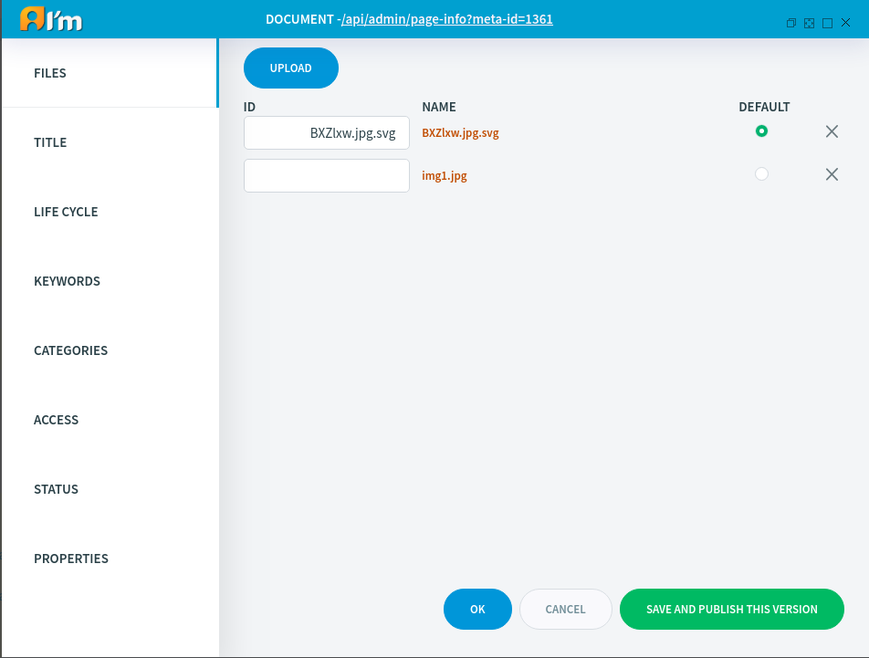

File Document Management
========================

In this article:
    - `Introduction`_
    - `Files Tab`_

------------
Introduction
------------

File Document represents a file or multiple files. When a user visits such a document, the system returns a file.
In this article, we'll take a look at the special tab for *File*, documents in the *Page Info*.

---------
Files Tab
---------

We can add files by clicking the **Upload** button. These files will be uploaded to the server, after saving the document.

If a file with the same name already exists, the system will add a serial number to the end of the name.
For example example.txt -> example1.txt.

.. warning:: Try not to use the same names in one document to avoid confusion.

**ID** can have characters. If this is not specified, then the value will be the same as the file name.
The user can set **ID** in the ``file_id`` parameter to get a file with that id.
For example, ``<domain-name>/<document-alias>?file_id=example-id``.
Without this parameter, the system will return the **default** file.

********
Deletion
********

If we delete a *file*, the system will delete it, provided that this document with this file has not been published before.

If we delete an entire *File document*, the system will delete all files associated with it (except for files that are used in other documents).

