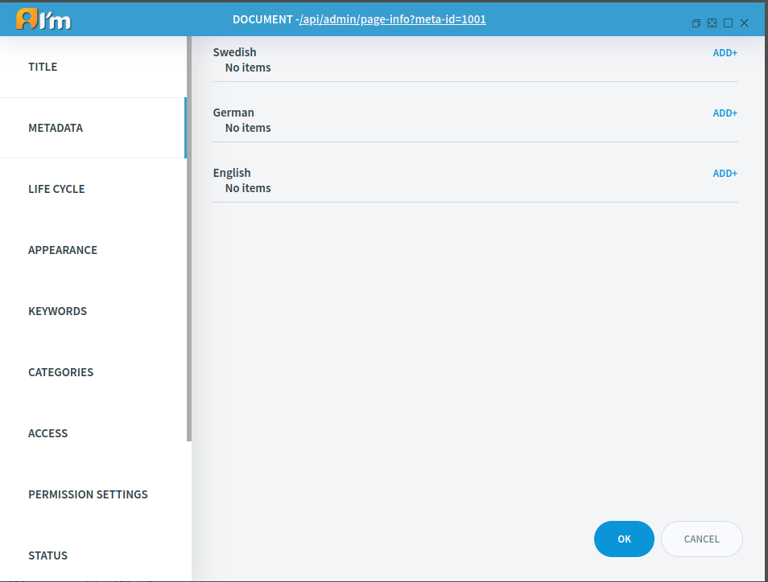
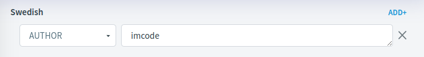
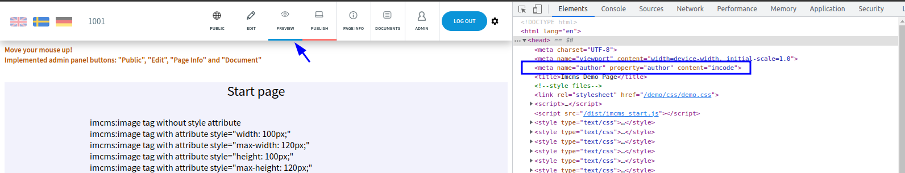
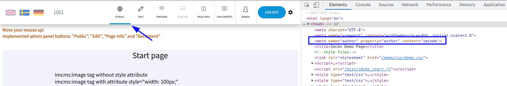
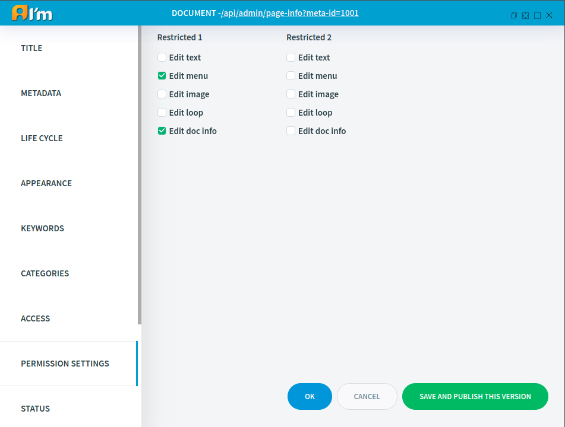
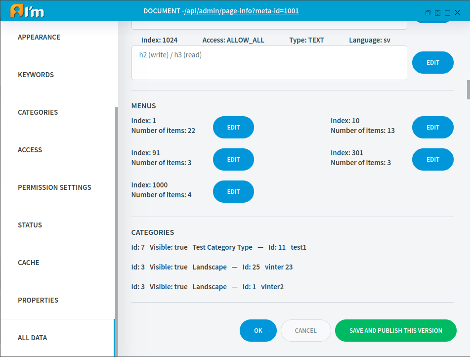

Text Document Management
========================

In this article:
    - `Introduction`_
    - `Metadata Tab`_
    - `Appearance Tab`_
    - `Permission Settings Tab`_
    - `All Data Tab`_

------------
Introduction
------------

Text Document represents a web page.
In this article, we'll take a look at special tabs for *Text* documents in the *Page Info*.

------------
Metadata Tab
------------

**Metadata** – is an equivalent entity to HTML ``<meta name=”…” property=”…” content=”…”>`` tag.

Here you can add, delete, change metas. Each language has unique metadata so you can control it differently.

In order to add new one, you have to:

1. Press **ADD+** button.

2. Then select required meta name.

.. image:: _static/metadata/metas.png

3. Write value.

In order to delete meta tag, you have to click on **X**.

*******
Preview
*******

**After saving**, you can see the added metas only **in Preview mode**.

**After publishing** the document, you can see the added metas also **on a public page**.

*************
Configuration
*************

If after adding metas you do not have them on the page, then
ask the developer to enable this feature or read :doc:`Metadata </developer-documentation/design/tags/metadata>` article.

If you need additional meta name, ask the developer to add it or
read :doc:`Metadata </developer-documentation/design/tags/metadata>` article.

--------------
Appearance Tab
--------------

**Template** is a page layout.

**Default child template** is a template that a new document will have after creating from the current document
(enter the id/alias of the current document at the time of creation).

.. image:: _static/page-info-appearance.png

-----------------------
Permission Settings Tab
-----------------------

This tab is used to set the restricted permission types that are used in the *Access* tab.

* **Edit text** - access to text editors + **VIEW**
* **Edit menu** - access to menu editors + **VIEW**
* **Edit image** - access to image editors + **VIEW**
* **Edit loop** - access to loop editors + **VIEW**
* **Edit doc info** - access to *Page Info*, with limitations (No access to *Metadata*, *Permission Setting*, *Properties*, *All data* tabs) + **VIEW**

.. seealso:: Read more about access control :doc:`here </user-documentation/access-control>`

------------
All Data Tab
------------

This tab displays all the content of the working version for each language.
We also have the opportunity to go to a separate editor and change the necessary content.

