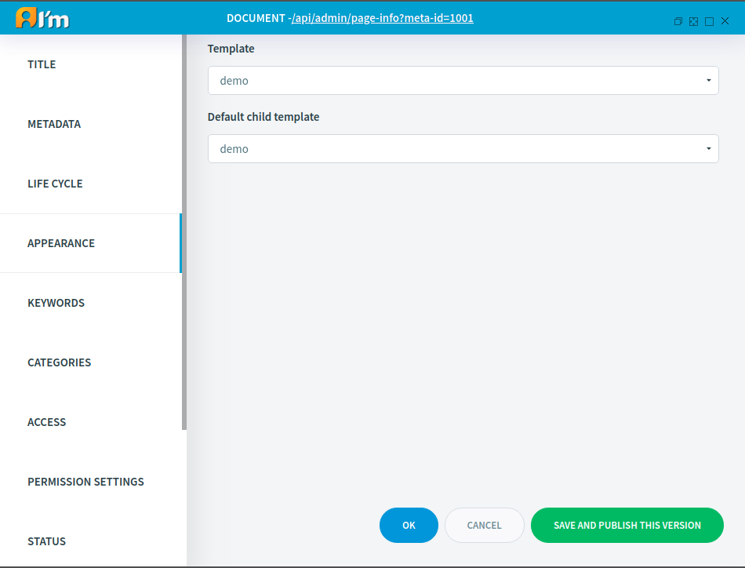

Text Document Management
========================

In this article:
    - `Introduction`_
    - `Metadata Tab`_
    - `Appearance Tab`_
    - `Permission Settings Tab`_
    - `All Data Tab`_

------------
Introduction
------------

Text Document represents a web page.
In this article, we'll take a look at special tabs for *Text*, documents in the *Page Info*.

------------
Metadata Tab
------------

Coming soon...

--------------
Appearance Tab
--------------

**Template** is a page layout.

**Default child template** is a template that a new document will have after creating from the current document
(enter the id/alias of the current document at the time of creation).

-----------------------
Permission Settings Tab
-----------------------

This tab is used to set the restricted permission types that are used in the *Access* tab.

.. image:: _static/page-info-permission-settings.png

* **Edit text** - access to text editors + **VIEW**
* **Edit menu** - access to menu editors + **VIEW**
* **Edit image** - access to image editors + **VIEW**
* **Edit loop** - access to loop editors + **VIEW**
* **Edit doc info** - access to *Page Info*, with limitations (No access to *Permission Setting*, *Properties*, *All data* tabs) + **VIEW**

.. seealso:: Read more about access control :doc:`here </user-documentation/access-control>`

------------
All Data Tab
------------

This tab displays all the content of the working version for each language.
We also have the opportunity to go to a separate editor and change the necessary content.

