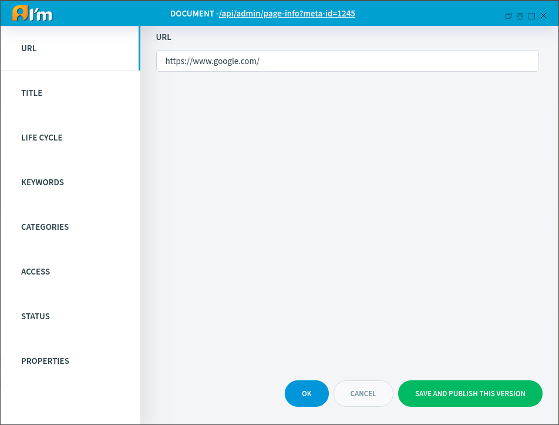

Url Document Management
=======================

In this article:
    - `Introduction`_
    - `URL Tab`_

------------
Introduction
------------

Url Document represents a link. When a user visits such a document, the system redirects to the specified link.
In this article, we'll take a look at the special tab for *Url*, documents in the *Page Info*.

-------
URL Tab
-------

You can edit link using this tab.

