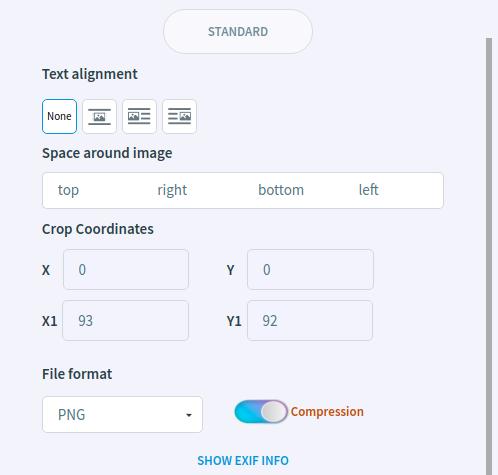

Image Editor
============

In this article:
    - `Open Image Editor`_
    - `Image Editor Show Mode`_
    - `Introduction`_
    - `Image Management`_
    - `Image Editing`_
    - `History`_
    - `Image Attributes`_

.. |reset| image:: _static/editor/reset-original.png

-----------------
Open Image Editor
-----------------

In order to open a image editor, you have to click |camera|.

Alternatively, you can open the editor in a separate window by clicking on the **Edit in a new window** link inside the editor on the header on the right.
This link can also be used the next times to open the separate editor.

----------------------
Image Editor Show Mode
----------------------

Text editor has *default* and *small* views on the page.

The *default editor* is highlighted on the page.

The content of the *small editor* immediately looks like a preview. Hover over **i** to see the label.

------------
Introduction
------------

Inside the image editor, we see the workspace with the edited image, editing tools on the top, and the image attributes on the right.

You can also switch and see the original state of the image by clicking **Original** at the top and right of the workspace.
Click **Edited** to switch back.

The developer can restrict image size by setting minimum width/length, fixed width/length, maximum width/length.
You can see this information in the area highlighted in yellow.

.. note:: Developer can limit the size of the image.

----------------
Image Management
----------------

In order to select a new image you need to go to the Image Library :doc:`Image Library</user-documentation/image/image-library>`
by clicking **Image library** button at the top and right.

**Save and close** button - save the image in current state and close the editor.

**Cancel and close** button - cancel all changes and close the editor.

**Remove and close** button - remove the image and close the editor.

*********
Languages
*********

You can switch to the same editor but for a different language by using the language flags on the right.
In addition, you can set the same image for all languages by enabling **All languages** checkbox.

-------------
Image Editing
-------------

.. list-table::

   * - |proportions|
     - enable/disable aspect ratio when cropping and resizing an image.
   * - |zoomPlus| |zoomMinus|
     - zoom in/out the image for viewing.
   * - |fit|
     - zoom out to fit the image completely within the work area.
   * - |crop|
     - enter a crop mode.
   * - |rotate|
     - enter a crop mode.
   * - |reset|
     - revert back to the original state of the image.
   * - |revert|
     - revert back to the preview state of the image.

.. note:: **Proportions** affects the process of cropping and resizing images.

*******
Cropper
*******

Click |crop| to enter a crop mode. Here you can crop the image by dragging the corners.

**Remove cropping** - revert to the previous accepted crop area.

**Revert to original** - revert to the original crop area.

**Apply** - apply changes.

********
Rotation
********

Click |rotate| to enter a rotate mode. Here you can rotate the image using |left| and |right|.

.. warning:: 90 degree rotation may not be available due to size restrictions that the developer may have set.

******
Resize
******

You can resize the image using the **Wanted Size** fields in the blue highlighted area. The size is specified in pixels.

.. warning:: Resizing may not be available or have borders due to size restrictions that the developer may have set.

-------
History
-------

If you click the **Show history** button, a table with previously saved images will appear.
The table shows the save time, the username, and the path to the image.

To apply the previous image, click on it in the list. To cancel - click **Cancel** below the table.

To close the history table click **Hide history** button.

.. note:: Max number of records in the history can be configured by developers.

----------------
Image Attributes
----------------

**Alt text** - the text to be displayed instead of the image if the upload fails. There is an example below.

.. note:: Whether this field is required can be configured by developers.

**Description text** - the text that can be be displayed in :doc:`Image Data tag </developer-documentation/design/tags/image-data>`.

**Image link** - the link that will open in a new tab if the user clicks on the image.

********
Advanced
********

Click **Advanced** to open advanced features and click **Standard** to close.

What can you do:

* Allow to write text around the image.
    The text editor gives you the option to use an image editor internally. You can allow text to write text around the image. There is an usage example below

    +---------------------------------------------------------------+
    + .. image:: _static/editor/advanced-text-alignment.png         +
    +---------------------------------------------------------------+
    + .. image:: _static/editor/advanced-text-alignment-example.png +
    +---------------------------------------------------------------+

* **Specify the coordinates at which the image will be cropped.**
* **Select the format in which the image will be saved.**
* Cancel the image compression process.
    Image compression reduces the size of the image, so image will take up less disk space and load faster on the page.
    Compression can sometimes degrade quality.
* View exif information.
    Exif info - metadata tags, information commenting on the file, describing the conditions and methods for obtaining it, authorship, etc.