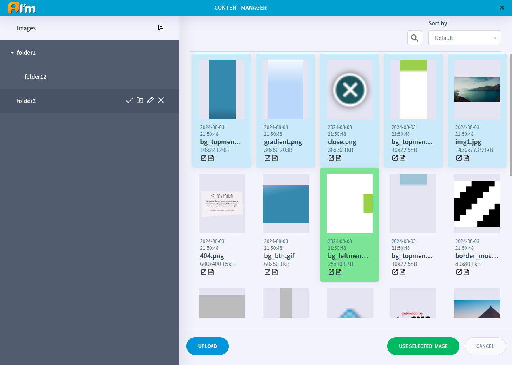

Image Library
=============

In this article:
    - `Introduction`_
    - `Choose Image`_
    - `File Management`_
    - `Custom Metadata`_

.. |edit| image:: _static/library/ic_text_editor.png
    :height: 12pt

.. |check| image:: _static/library/icon_folder_controll_reverse_check.png

.. |metadata| image:: _static/library/icon_metadata.png
    :height: 12pt

------------
Introduction
------------

The *Image Library* has a file structure and is used to store and manage original images.

You can open the library in two ways:

* *Image Editor* -> **Image Library** button.

* *Admin page* -> *Files* tab -> **Image Library** button.

------------
Choose Image
------------

In order to choose an image to use in the :doc:`Image Editor</user-documentation/editors/image/image-editor>`,
click on the image (highlighted in green) and then click the **Use selected image** button.

---------------
File Management
---------------

In order to **upload images**, **go to the folder** where you want to have it and **click Upload** button.

In order to find out **what images are used in documents**, click |check| in the line with the folder name.

In order to **delete an image**, **hover over the image block** and **click X** that appears.
You cannot delete an image if it is used in some document.

In order to **move an image** to another folder, **hold down the mouse button** on the desired image and **move it to** the name of the **another folder**.

In order to **open a folder**, **click** on it.

In order to **change the sorting of images** in a folder, you have to **select** the required sorting **in the drop-down list at the top and right**.
Default sorting - from newest to oldest.

In order to **create a folder**, you have to **click** |create| in the line with the name of the parent folder, **enter a name**, **click** |check|.

In order to **rename a folder**, you have to **click** |edit| in the line with the name of the folder, **change the name**, **click** |check|.

In order to **delete a folder**, you have to **click X** in the line with the name of the folder.
You cannot delete a folder if it contains files.

---------------
Custom Metadata
---------------

ImCMS provides the ability to edit some metadata values. To do this, you have to click |metadata|.

