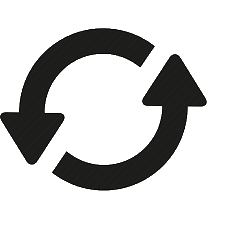
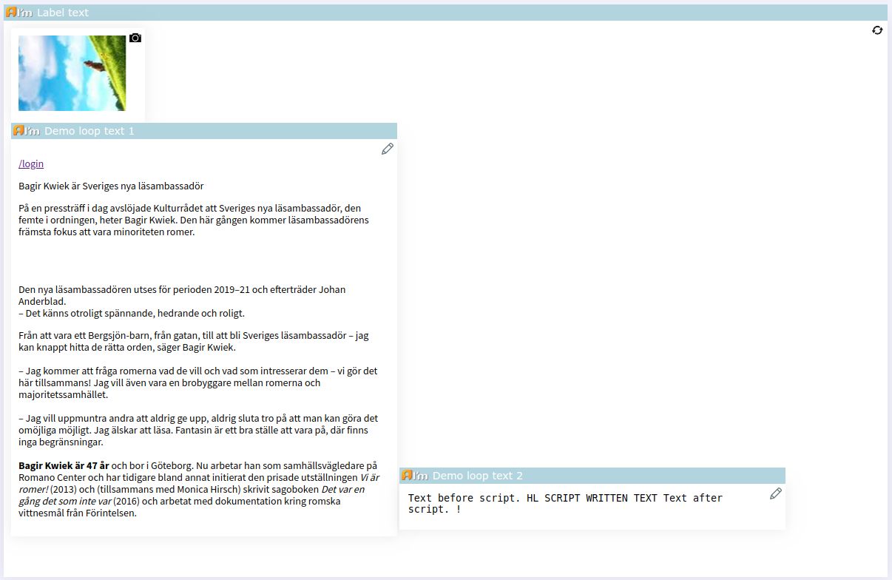
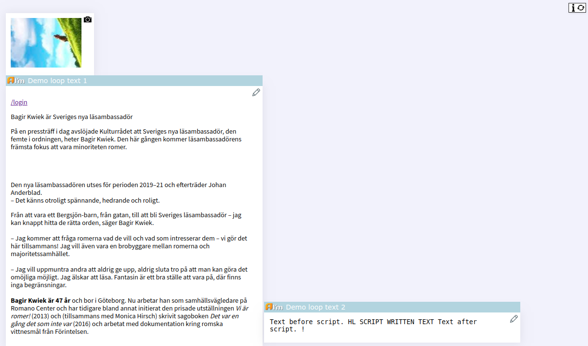
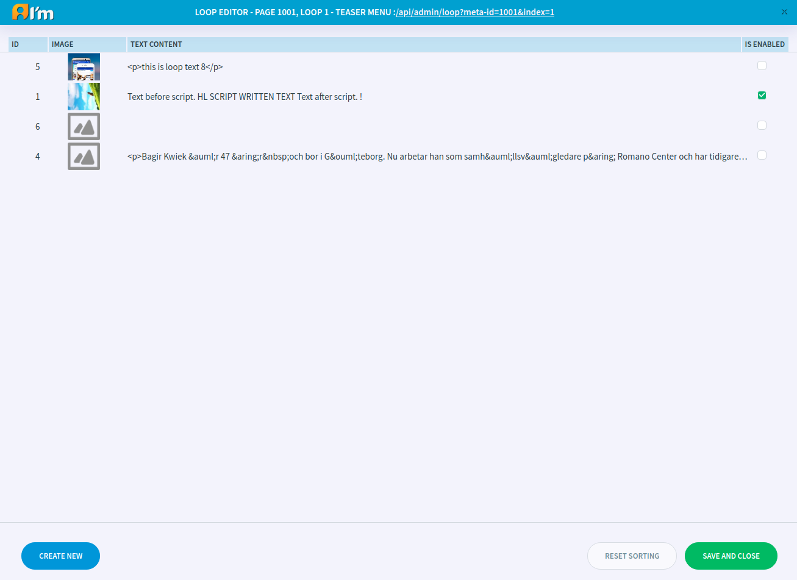

Loop Editor
===========

In this article:
    - `Open Loop Editor`_
    - `Loop Editor Show Mode`_
    - `Introduction`_
    - `Entry Management`_

----------------
Open Loop Editor
----------------

In order to open a loop editor, you have to click |loop|.

Alternatively, you can open the editor in a separate window by clicking on the link inside the editor on the header.
This link can also be used the next time to open the separate editor.

---------------------
Loop Editor Show Mode
---------------------

Loop editor has *default* and *small* views on the page.

The *default editor* is highlighted on the page.

The content of the *small editor* immediately looks like a preview. Hover over **i** to see the label.

.. note:: Developer can also set *small* view for editors inside loop.

------------
Introduction
------------

A loop is a cycle of one or more combined content types.
For example, 5 times display different images on the left and different texts on the right.

This combination is set by the developer in the template. Admin can add, delete, sort entries in the loop using the loop editor.

----------------
Entry Management
----------------

.. note:: You cannot change the content using the loop editor.
    For example, in order to change an image, you have to return to Edit mode and use image editor.

**Create new** button - create a new entry.

In order to enable(show)/disable an entry use a checkbox in **IS ENABLED** column.

In order to change the order of an entry, hold the mouse cursor on the element and drag it up or down. Use **Reset sorting** button to undo these changes.

In order to delete an entry, hover over the mouse and click on the **X** that appears.

**Save and close** button - save changes and close the editor.
