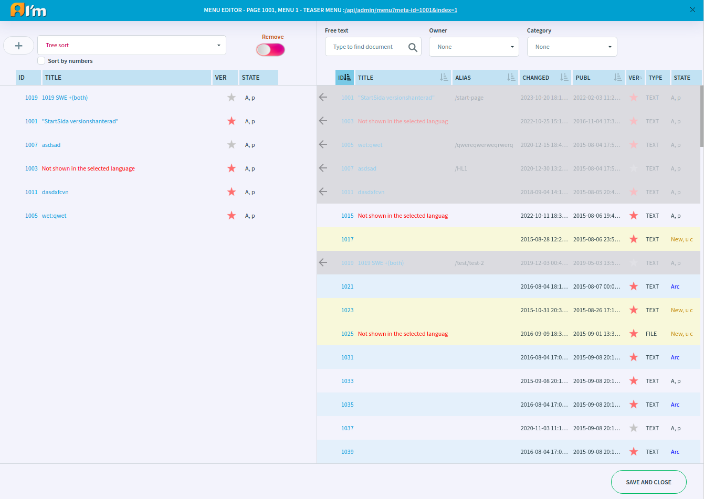
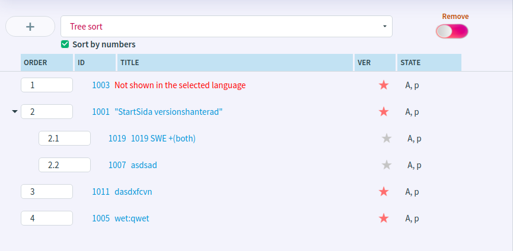
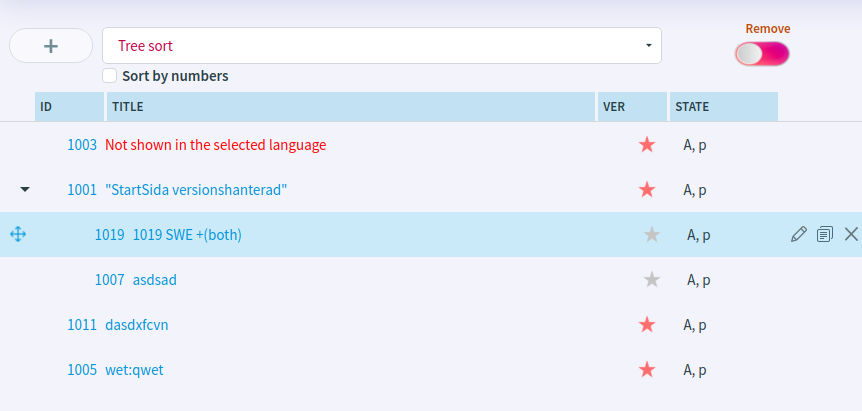

Menu Editor
===========

In this article:
    - `Open Menu Editor`_
    - `Menu Editor Show Mode`_
    - `Introduction`_
    - `Menu Item Visibility`_
    - `Menu Item Management`_
    - `Menu Item Sorting`_
    - `Document Management`_

.. |pencil| image:: _static/menu/ic_text_editor.png
    :height: 12pt

.. |copy| image:: _static/menu/icon_folder_controll_copy.png
    :height: 12pt

----------------
Open Menu Editor
----------------

In order to open a manu editor, you have to click |edit|.

Alternatively, you can open the editor in a separate window by clicking on the link inside the editor on the header.
This link can also be used the next times to open the separate editor.

---------------------
Menu Editor Show Mode
---------------------

Text editor has *default* and *small* views on the page.

The *default editor* is highlighted on the page.

The content of the *small editor* immediately looks like a preview. Hover over **i** to see the label.

------------
Introduction
------------

Menu items are documents.

The menu editor consists of a workspace for manipulating menu elements and :doc:`Document Manager </user-documentation/document-management/document-manager>`.

--------------------
Menu Item Visibility
--------------------

ImCMS has a version and access control system. Therefore, the menu item may be invisible to users.

In order to make a **document visible to a authorized** user in a menu, you have to:

1. Make sure the document is **published**. You can check it in **State** column.
2. Enable **VIEW for all users** or give **VIEW** for one of the user's roles.

In order to make a **document visible to a unauthorized** user in a menu, you have to:

1. Make sure the document is **published**. You can check it in **State** column.
2. Enable **VIEW for all users**. Or use **Show link to unauthorized users** to show document to all users, but note that a user who does not have access cannot visit the document.

.. seealso:: Read more about access control :doc:`here </user-documentation/access-control>`.

--------------------
Menu Item Management
--------------------

In order to *add a new item* to the menu, you have to:

1. Hold |nest| that appears in the row of the document in the list.
2. Move it to workspace on the left.

You can *remove an item* in two ways:

1. Move the mouse cursor over the item and click **X** that appears.
2. Enable **Multi-remove**, select items and click **Remove**.

.. note:: Admin must have access to a document that he wants to add to the menu.
    Or this document must have enabled **Share the document with other administrators**.
    Read more about access control :doc:`here </user-documentation/access-control>`.

-----------------
Menu Item Sorting
-----------------

Possible sorting of items in the menu:

* **Tree Sort** - sorting manually *with the ability to nest items* inside others.
* **Manual** - sorting manually *without nested items*.
* **Alphabetical (A-Z)** - alphabetical sorting by title from A to Z.
* **Alphabetical (Z-A)** - alphabetical sorting by title from Z to A.
* **Published (new first)** - sorting by publication date from latest to oldest.
* **Published (old first)** - sorting by publication date from oldest to latest.
* **Changed (new first)** - sorting by date modified from latest to oldest.
* **Changed (old first)** - sorting by date modified from oldest to latest.

We can manage menu items using numbers or by dragging the items while sorting manually.

*****************
Manage by numbers
*****************

Enable the **Sort by numbers** checkbox under the dropdown list of sort options.

The order of the items is indicated by numbers, starting from 1.

*Tree sort* sorting allows to nest items. To nest an item, you have to use a dot (**.**) and start the order inside from 1.
For example, the item is first - 1 and has 1.1, 1,2 items inside.

******************
Manage by dragging
******************

Disable the **Sort by numbers** checkbox under the dropdown list of sort options.

In order to change an item position, you have to hold the mouse on the document (anywhere, but not |nest|) and move up or down.

*Tree sort* sorting allows to nest items. In order to nest an item, you have to:

1. Move the mouse cursor over the item.
2. Hold the mouse cursor on |nest| that appears on the left.
3. Drag an item to another item.

In order to pull out an item, you have to:

1. Move the mouse cursor over the item.
2. Hold the mouse cursor on |nest| that appears on the left.
3. Drag the item outside of the current parent item.

-------------------
Document Management
-------------------

In order to *create a new document*, you have to:

1. Click **+** button on the top left.
2. In the open window, select the document type and click **Ok**.
3. Choose a profile (more details :doc:`here </user-documentation/admin-settings/profiles>`) or a document id/alias that will be inherited for the current document and click **Create**.
4. Click **Ok** after filling in the required fields in the page info.

In order to *edit a document*, you have to move the mouse over the item representing the document and click |pencil| that appears.

In order to *copy a document*, you have to move the mouse over the item representing the document and click |copy| that appears.
