Text Editor
===========

In this article:
    - `Open Text Editor`_
    - `Text Editor Show Mode`_
    - `Text Editor Types`_
    - `Text Editor Tools`_

.. |pencil| image:: _static/text/ic_text_editor.png
    :height: 12pt

.. |fullScreen| image:: _static/text/full-screen.png

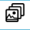

.. |textMode| image:: _static/text/text-mode.png

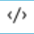

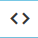

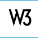

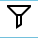

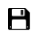

----------------
Open Text Editor
----------------

In order to open a text editor, you have to click |pencil| or click on the text inside.

Besides, you can open the editor in a separate window by pressing |fullScreen| and clicking on the link to the right of all buttons.
This link can also be used the next times to open the separate editor.

---------------------
Text Editor Show Mode
---------------------

Text editor has *default* and *small* views on the page.

The *default editor* is highlighted on the page.

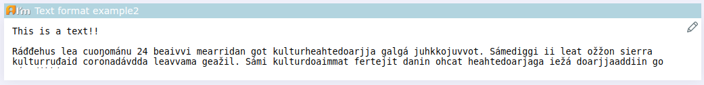

The content of the *small editor* immediately looks like a preview. Hover over **i** to see the label.

.. image:: _static/text/editor-small-show-mode.png

-----------------
Text Editor Types
-----------------

There are three modes of text editor: *plain text*, *html* and *what-you-see-is-what-you-get* editors.

*Plain text* mode allows you to enter only text.

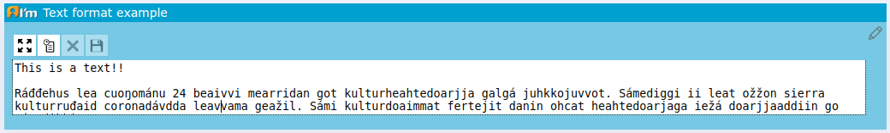

*HTML* mode allows you to enter html markup. Additionally you can validate and filter written html.

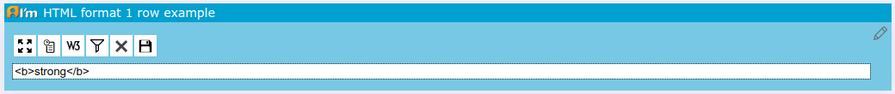

*What-you-see-is-what-you-get* mode opens up all features of the text editor. You can also switch to other modes.

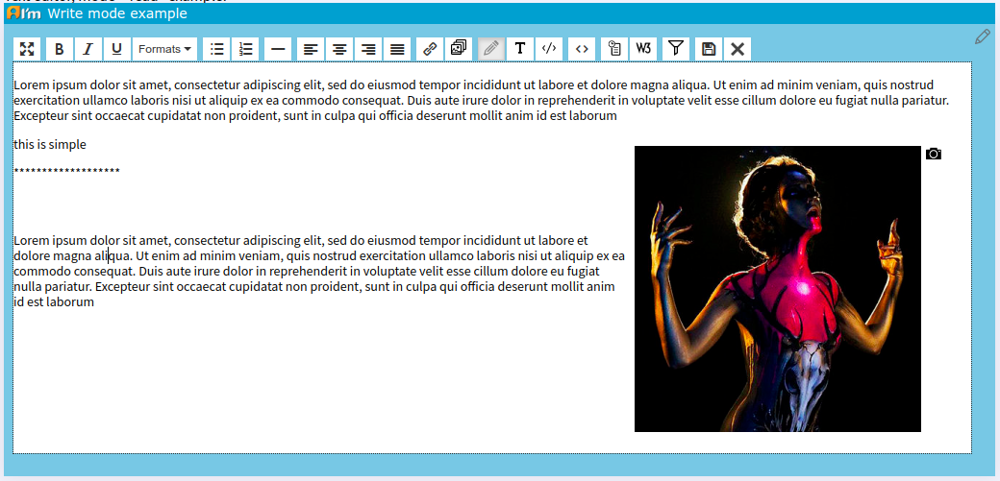

-----------------
Text Editor Tools
-----------------

+----------------+------------------------------------------------------+
+ |fullScreen|   + open the editor in full screen.                      +
+----------------+------------------------------------------------------+
+ |link|         + add a hyperlink.                                     +
+----------------+------------------------------------------------------+
+ |image|        + add an image editor with which you can add an image. +
+----------------+------------------------------------------------------+
+ |tinymceMode|  + switch to *what-you-see-is-what-you-get* mode.       +
+----------------+------------------------------------------------------+
+ |textMode|     + switch to *Plain text* mode.                         +
+----------------+------------------------------------------------------+
+ |htmlMode|     + switch to *HTML* mode.                               +
+----------------+------------------------------------------------------+
+ |source|       + view/edit the source code.                           +
+----------------+------------------------------------------------------+
+ |history|      + open history window.                                 +
+----------------+------------------------------------------------------+
+ |htmlValidate| + checks the markup validity in HTML.                  +
+----------------+------------------------------------------------------+
+ |save|         + save changes.                                        +
+----------------+------------------------------------------------------+
+ |cancel|       + cancel changes.                                      +
+----------------+------------------------------------------------------+

*********
Hyperlink
*********

A hyperlink is a link to another page that is represented as text.

A such window will open after clicking |link|.

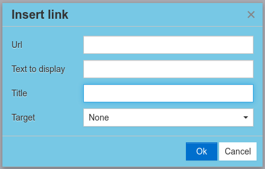

* **URL** - the link to another page.

* **Text to display** - the text that will be shown instead of the link.

* **Title** - the text to be displayed when the cursor is held down.

* **Target**
    * **None** - open the link in this window.
    * **New window** - open the link in a new window.

*******
History
*******

A such window will open after clicking |history|.

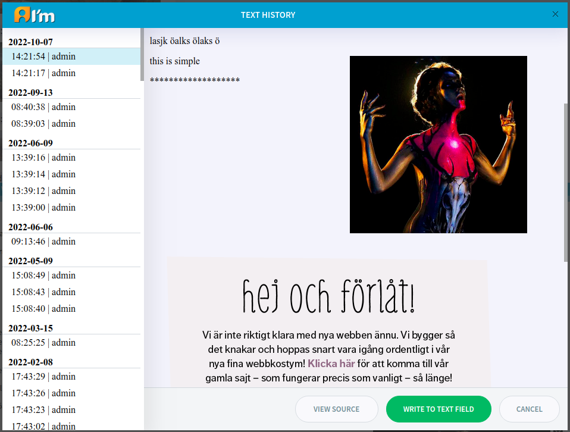

In order to *revert back to the previous version* of the text in this editor,
you have to find and select the required version on the left and click **Write to text field**.

**View Source** - view the source code.

.. note:: Max number of records in the history can be configured by developers.
