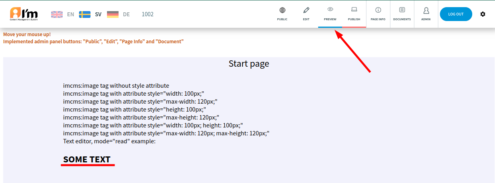

First Web Page
==============

You see the default page when you go into ImCMS. In order to create own page, follow next steps:

1. Log in
"""""""""

Go to ``<domain-name>/login``, enter admin/admin. You are a superadmin now.

2. Create a text-type document
""""""""""""""""""""""""""""""

Go to *Document Manager*.

Press *+* button.

Select *Text Document*.

Enter *1001* and press *Create* button.

**Specify another alias and title**

Press *OK* button. We can see the document we created in the list.

3. Edit text
""""""""""""

Go to *Edit* mode. And click the indicated button to start editing the text.

Write something in the field, specify the desired styles, and click the indicated button to save the changes.

4. Switch to preview mode
"""""""""""""""""""""""""

Let's switch to preview mode to check how our page looks.

6. Publish the document
"""""""""""""""""""""""

Everything is fine. Let's publish the document to make it available to everyone. Click *Publish* button on the admin panel.

6. Log Out
""""""""""

Click *Logout* button on the admin panel.

7. Check the result
"""""""""""""""""""

You're a regular visitor now. Note that this page is available by the alias we specified earlier.

